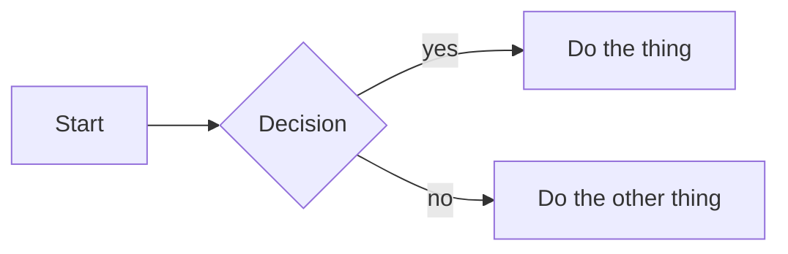

# Talk Title

The one-line promise of the talk

<div class="pt-8 text-sm opacity-70">
Where and when — conference, meetup, date
</div>

<!--
Presenter notes go in HTML comments. They show in presenter mode (press `p`)
and never render on the slide.
-->

---

## A plain slide

Regular markdown. **Bold**, *italic*, `code`.

Keep one idea per slide.

---
layout: two-cols
---

## Code beside a visual

Stepped highlighting is the reason this deck is Slidev — each click advances
to the next range.

```python {all|1|2-3}
def example(x):
    if x > 0:
        return "positive"
    return "not positive"
```

::right::

<div class="pl-6 pt-10 flex flex-col items-center">
  <div class="h-56 w-full rounded-lg border border-dashed opacity-40 flex items-center justify-center text-sm">
    drop an image in assets/ and swap this for &lt;img&gt;
  </div>
  <div class="text-xs opacity-60 pt-2">Caption for the image</div>
</div>

---

## Bullets that arrive one at a time

<v-clicks>

- First point lands
- Then the second
- Then the third

</v-clicks>

---

## A diagram

Mermaid renders live — no build step, unlike static SVG.



---
layout: center
class: text-center
---

# Takeaway

### *The single sentence you want remembered.*

<div class="pt-6 text-sm opacity-70">felipe@felipevr.com · github.com/fbidu</div>
