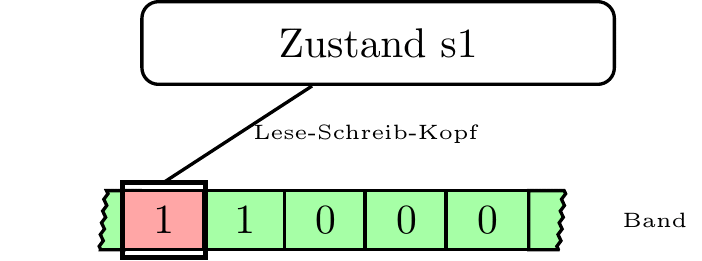
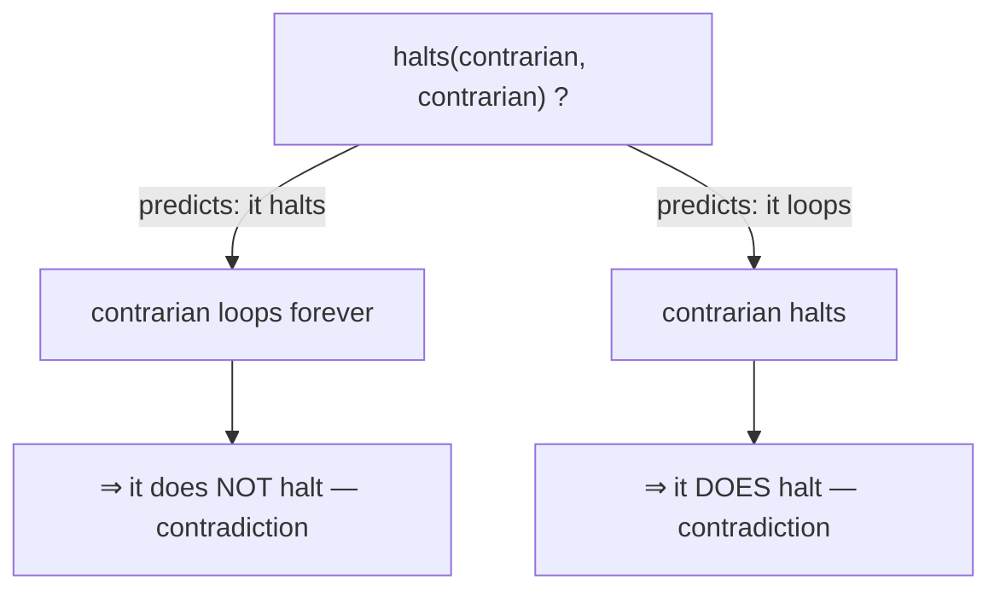

# The Computability Problem

Why some questions about code can never be answered by code

<div class="pt-8 text-sm opacity-70">
A lightning talk on Turing's Halting Problem — no CS degree required
</div>

<!--
~5 minutes. The goal isn't rigor, it's the "aha": impossibility is provable,
and it quietly shapes the tools we use every day.
-->

---

## We've all wanted this tool

You've shipped code that hung in production.
A test that never finishes. A CI job stuck forever.

Wouldn't it be great if something could just **tell you** —
*before* you run it — whether your program will finish?

<div class="flex justify-center pt-6">
  
</div>

---
layout: two-cols
---

## The dream function

```python
def halts(program, data) -> bool:
    """True  -> finishes
       False -> loops forever"""
    ...  # always correct, somehow
```

The perfect infinite-loop detector —
drop it in your linter and never
ship a hang again.

::right::

<div class="pl-6 pt-10 flex flex-col items-center">
  
  <div class="text-xs opacity-60 pt-2">A Turing machine — the 1936 model of "a program"</div>
</div>

---

## Alan Turing, 1936

He proved this function **cannot exist** — *before the first computer was built.*

Not "it's hard." Not "we haven't figured it out yet." → **Impossible.**

---

## The trick: self-reference

A program is just **text**. Text is just **data**.

So a program can run on *another* program — even **itself**.

<div class="opacity-70 pt-4">You rely on this daily: compilers, interpreters, <code>eval</code>.</div>

---

## Build a troublemaker

Assume `halts` exists. We use it against itself:

```python {all|2|3-4|5-6}
def contrarian(program):
    if halts(program, program):
        while True:      # predicted to halt? then loop FOREVER
            pass
    else:
        return           # predicted to loop? then halt NOW
```

`contrarian` always does the **opposite** of the prediction.

---

## Now run `contrarian(contrarian)` — does it halt?



Every answer contradicts itself.

---

## Therefore

The only thing we assumed was that `halts` exists.

<div class="text-3xl pt-6">So <code>halts</code> <b>cannot exist.</b></div>

<div class="pt-4">The Halting Problem is <b>undecidable</b>.</div>

<!--
This argument shape — assume it exists, feed it itself, derive a contradiction —
is "diagonalization", the same trick that shows there are more reals than integers.
-->

---

## Why a working engineer cares

<v-clicks>

- No linter or type checker catches **every** bug — *Rice's theorem*
- "Will this terminate?" has **no** general algorithm
- **Perfect** static analysis is mathematically off the table
- So real tools approximate: false positives, false negatives, timeouts

</v-clicks>

---

## The good news: we dodge it

<v-clicks>

- **Timeouts** — give up after N seconds
- **Restricted languages** — terminating by construction (SQL, Dhall, Coq)
- **Heuristics** — be *sound* or *complete*, pick one
- **Type systems** — rule out whole classes of failure up front

</v-clicks>

<div class="pt-6 opacity-80">Engineering is the craft of useful approximations to impossible problems.</div>

---
layout: center
class: text-center
---

# Takeaway

### *Turing didn't find the answer — he proved there isn't one.*

Some questions about code can never be answered by code.

<div class="pt-6 text-sm opacity-70">felipe@felipevr.com · github.com/fbidu</div>
