<!-- _class: lead -->
<!-- _paginate: false -->

# The Computability Problem

## Why some questions about code can never be answered by code

A lightning talk on Turing's Halting Problem — no CS degree required

<!-- ~5 minutes. The goal isn't rigor, it's the "aha": impossibility is a real, provable thing, and it shapes the tools we use every day. -->

---

## We've all wanted this tool

You've shipped code that hung in production.
A test that never finishes. A CI job stuck forever.

Wouldn't it be great if something could just **tell you** —
*before* you run it — whether your program will finish?


<!-- Make it personal. Ask for a show of hands: who has had a process stuck in an infinite loop? -->

---

## The dream function

<div class="columns">
<div>

```python
def halts(program, data) -> bool:
    """True  -> finishes
       False -> loops forever"""
    ...  # always correct, somehow
```

The perfect infinite-loop detector —
drop it in your linter and never
ship a hang again.

</div>
<div>


<p class="cap">A Turing machine — the 1936 model of "a program"</p>

</div>
</div>

---

## Alan Turing, 1936

He proved this function **cannot exist.**

Not *"it's hard."*
Not *"we haven't figured it out yet."*

**Impossible** — and he proved it *before the first computer was built.*

<!-- 1936, "On Computable Numbers". Computers were still thought experiments. -->

---

## The one weird trick: self-reference

A program is just **text**. Text is just **data**.

So a program can take *another program* as its input —
even **itself**.

You rely on this every day: compilers, interpreters, `eval`,
formatters that format their own source.

---

## Let's build a troublemaker

Assume `halts` exists. We'll use it against itself:

```python
def contrarian(program):
    if halts(program, program):
        while True:      # halts says "finishes"? then loop FOREVER
            pass
    else:
        return           # halts says "loops"? then finish immediately
```

`contrarian` always does the **opposite** of the prediction.

---

## Now run `contrarian(contrarian)` — does it halt?



Every answer contradicts itself.

---

## Therefore

The only thing we assumed was that `halts` exists.

So that assumption must be false:

> ## `halts` cannot exist.

The Halting Problem is **undecidable.**

<!-- This shape of argument — assume it exists, feed it itself, derive a contradiction — is "diagonalization". Same trick proves there are more real numbers than integers. -->

---

## Why a working engineer should care

This is the bedrock under your tools — not academic trivia:

- No linter, type checker, or analyzer can catch **every** bug.
  *(Rice's theorem: any non-trivial question about behavior is undecidable.)*
- "Will this terminate?" has **no** general algorithm.
- **Perfect** static analysis is mathematically off the table.

That's why real tools have false positives, false negatives, and timeouts.

---

## The good news: we dodge it

We don't solve the impossible — we sidestep it:

- **Timeouts** — give up after N seconds
- **Restricted languages** — terminating by construction (SQL, Dhall, Coq)
- **Heuristics** — be *sound* or *complete*, pick one
- **Type systems** — rule out whole classes of failure up front

> Engineering is the craft of useful approximations to impossible problems.

---

<!-- _class: lead -->

# Takeaway

### *Turing didn't find the answer — he proved there isn't one.*

Some questions about code can never be answered by code.

felipe@felipevr.com · github.com/fbidu
