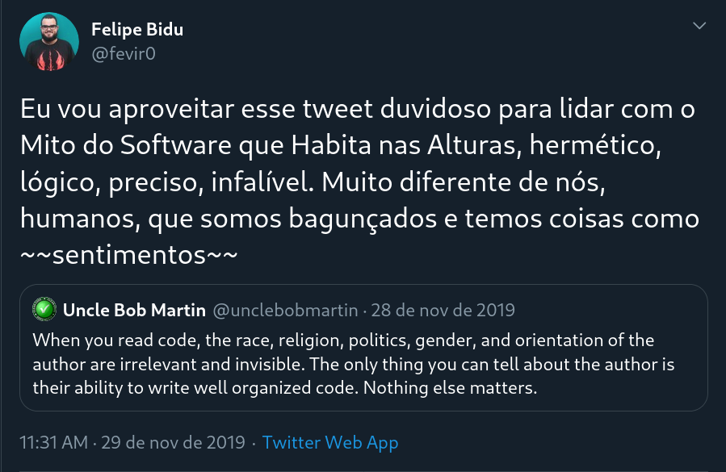

# Humanos e Códigos

#### Para _quem_ a gente escreve?


Aperte a tecla `"s"` para ver as notas de apresentação!


### Oi, eu sou o (Felipe) Bidu!

* [github.com/fbidu](https://github.com/fbidu)
* Instituto de Computação - UNICAMP
* Desenvolvedor na [Ingresse](https://ingresse.com)


# As _maravilhas_ da nossa área

Note:
* Eu vou começar falando sobre algumas características gerais da área de desenvolvimento de software em si.
* Existe um debate se a chamada 'engenharia de software' é ou não uma engenharia
  de verdade e onde ela se encaixa no conjunto de áreas técnicas e científicas
* Seja como for, a nossa área tem uma capacidade que é rara e muito importante


## Introspecção

_A capacidade de resolver problemas de software fazendo *OUTRO* software_

Note:
* A introspecção - a capacidade que nós temos de construirmos softwares que resolvem
  problemas que nós temos no processo de construção de softwares - é um aspecto
  da nossa área que pode passar despercebido por nós mas, quando começamos a
  prestar atenção, ela tá em todo lugar


Note:
* Por exemplo, uma "sprint" nossa pode começar com nós ou algum colega usando
  de softwares como Jira ou Trello para descrever e gerenciar as tarefas que
  precisamos executar dentro do software que estamos autorando


Note:
* Então a gente utiliza outro software como o Git pra organizar nosso código,
  colaborar com outras pessoas, etc


Note:
* Finalmente vai chegando a hora do deploy! Aí nós temos toda uma nova pilha,
  carinhosamente chamada de "stack", de software para lidar. Containers, servidores
  de CI, servidores de CD, os próprios servidores em produção, paineis de monitoramento
  etc, etc, etc


Note:
* No fim de uma feature, uma única pessoa vai ter contato com uma dezena de softwares
  diferentes - tudo para que consiga desenvolver um único software.
* Das nossas IDEs e editores, passando por nossos linters, testers, sistemas de
  automação e etc o nosso código é processado por uma quantidade gigantesca
  de outros softwares ao longo do caminho de desenvolvimento


Isso tudo é ruim?
Note:
* Eu acho essa introspecção, essa capacidade que desenvolvimento de software tem
de olhar para si e usar da própria área de conhecimento para resolver seus problemas,
uma coisa incrível.
* No entanto, essa nossa facilidade em criar softwares novos para resolver problemas
do processo de criação do software pode fazer com que a gente entre num ciclo
vicioso, pensando mais em software sobre software sobre software do que sobre
os outros aspectos do nosso processo criativo como nossos colegas, nosso local de trabalho,
o mercado em que atuamos, as relações éticas cada vez mais complicadas entre
geração e uso de dados pessoais de nossos clientes, entre outras coisas.


Note:
* De fato, com a popularização de computadores, celulares e dispositivos IoT,
as relações entre o mundo digital e a vida física das pessoas se torna cada
vez mais complexa.
* Nós não podemos mais falar de segurança da informação, por exemplo, sem pensar
no impacto bastante real que essas decisões terão na vida pessoal de nossos usuários
* Também não podemos mais discutir sobre a sistematização e o escalonamento de
certos mercados através de uma solução via software sem considerar as relações
sociais e comerciais que já estavam envolvidas naquele mercado e que com
certeza serão aprofundadas e intensificadas por nossos códigos


[Dieselgate](https://www.ednh.news/vw-dieselgate-fraud-timeline-of-a-scandal/)
Note:
* Em nossa defesa - a nossa área ainda está engatinhando. O primeiro software
comercial foi fabricado no começo da década de 60. Desenvolvimento de software
é praticamente um bebê perto de áreas como a construção civil.
* Por outro lado, essas discussões estão se tornando cada vez mais importantes.
Eu atuo com desenvolvimento de software faz muitos anos, a primeira vez que eu
vi uma discussão séria sobre ética na nossa área foi em 2015, quando descobriram
o Dieselgate da Volkswagen, um software que deturpava testes de emissão de poluentes.
Vocês podem ver mais informações nesse link


Note:
* Tem muita coisa legal e importante para ser discutida entre essas relações
humanos-software mas vamos começar com baby steps.
* Hoje eu quero discutir com vocês particularmente a parte do desenvolvimento de
software que provavelmente é mais próxima do desenvolvedor em si - o código.


Note:
* Vamos começar considerando a pergunta - o quê ou quem é o principal leitor
do nosso código?
* Pode ser tentador responder que o principal "público-alvo" de um código é
um computador. Afinal, escrevemos código para fazer a máquina trabalhar
por nós!
* Por outro lado, nós sabemos que alguns aspectos de um código como uma escolha
concisa de nomes para funções, classes e variáveis, uma formatação bem feita
e coesa, documentação sobre as APIs expostas pelos nossos códigos e etc são
aspectos importantes.


Note:
* O que vocês estão vendo agora é um diagrama geral de um compilador,
com as etapas que um código passa, desde começar ali em cima no canto esquerdo
até chegar em alguma coisa que um computador vai de fato ler, no canto inferior direito.
* O nosso código em seu aspecto mais amplo só de fato importa pra esse processo
até mais ou menos o terceiro quadradinho. Depois da quinta etapa - "translate" -
nem mesmo a linguagem de programação que a gente usou importa mais. E a gente
não tá nem na metade do caminho até o computador!
* Então eu volto a perguntar, será que o nosso código é feito para ser lido pelo
computador?


Note:
* Hoje, eu vim aqui para defender que não importa o tanto de software que a
gente usa para escrever software, não importa que um processador esteja
no final da cadeia de execução, códigos são escritos para serem lido
sobretudo por seres humanos.
* A questão central para mim é que software no sentido de um produto digital ou
no sentido comumente usado junto de métodos de engenharia de software, esses softwares não costumam ser pequenas porções de código escritas em um dia por uma pessoa e
jogados fora no outro mas sim são obras colaborativas complexas nas quais ideias são
materializadas _através_ do código.
* Em softwares assim, o código atua como um meio de comunicação de conceitos
abstratos pensados por um colega, compartilhado para outros e desenvolvido
colaborativamente por muitos.
* Antes de um código cair num pipeline de deploy que vai levâ-lo para um sistema
em produção, ele já passou e repassou por diversos olhos e mãos bastante humanos.
Esquecer ou falhar em prestar atenção de que um dos papeis principais de um
código é servir como meio de comunicação entre nós e nossos colegas pode nos
fazer cometer escolhas erradas na hora de julgar quais processos usar, quais
ferramentas usar, como organizar nosso trabalho, o que avaliar ao revisar
nossos códigos, entre outras coisas. Afinal, se o objetivo principal do código
não é bem compreendido, como que vamos otimizar de maneira correta o processo
de criação dele?


Note:
* Você talvez não esteja colocando muita fé no meu argumento central, de que
existe uma relação intrincada entre nosso código e os componentes bastante
humanos do desenvolvimento de software
* Você talvez pense como um certo autor de 'clean livros' sobre 'clean code'
nesse 'clean tweet' que alega "quando você lê código, a raça, religião, visão
política, gênero e oritentação do autor são irrelevantes e invisíveis! A única
coisa que você pode dizer sobre o auto é a sua habilidade de escrever código
bem organizado. Nada mais importa"



Note:
* A minha resposta pra essa alegação bem duvidosa do Bob vocês podem ler depois
no meu Twitter, vou deixar fixado lá. Me sigam gente, eu de vez em quando posto
coisas sérias também!
* Como vocês podem ver aqui no começo da minha resposta, eu não sou um grande
fã dessa visão d'O Software como sendo essa entidade limpa, higienizada, livre
dos problemas e vieses da humanidade e etc
* No caso que estamos lidando aqui hoje, existe uma outra observação que eu acho
mais relevante


Note:
* Essa observação é a chamada Lei de Conway. Ela não é uma lei no sentido científico
do termo, mas ela é uma observação que tem se mostrado válida ao longo de diversos
testes desde a década de 60
* A lei de Conway diz que o software criado por uma organização tende a ter uma
estrutura que é um espelho da forma como a comunicação interna daquela organização
funciona
* Isso é, uma companhia que possui uma estrutura extremamente hierárquica e
dividida em camadas terá dificuldades em montar uma arquitetura baseada em
microsserviços, uma vez que essa arquitetura demanda uma comunicação mais
livre, baseada em pequenos grupos autônomos
* Nesse ponto nós começamos a notar como a forma de comunicação entre nós,
desenvolvedores, com o resto da nossa empresa é marcada em nossos softwares
* Se você quer fazer uma reorganização na estrutura do software da sua empresa,
por exemplo migrar de uma arquitetura monolítica em camadas para uma de microsserviços,
como anda na moda, é bem provável que focar só na arquitetura do código em si
sem pensar em como as pessoas se comunicam em geral vai causar uma tensão nessa
estrutura - você vai forçar o software pra um caminho que não encontra espelho
na forma como a empresa se organiza. Nessa situação, podemos usar a lei de
conway a nosso favor e, ao invés de fazermos uma observação passiva de como
estruturas de software seguem estruturas sociais, podemos iniciar uma mudança
no aspecto social para então favorecer uma mudança na estrutura do software.


## Código Comunica Ideias
Note:
* Um ponto importante nessa discussão é a visão de que o código atua como esse
  meio de transmissão de ideias.
* Ao considerarmos o código desse jeito, começamos a observar certos padrões de
  uso


```python
def test_feature_nova():
  """
  E se a gente adicionasse essa flag?
  """

  assert nosso_software.proposta(teste) == "olar!"
```
Note:
* Quem aqui utiliza de TDD ou participa de Code Dojos talvez já esteja mais
  por dentro dessa visão. Quer propor uma coisa nova em um pedaço de código?
  Que tal escrever um teste - que vai falhar - demonstrando o comportamento
  que você espera? Talvez isso ofereça uma visão mais clara do que você
  pretende.
* Essa é uma estratégia que eu particularmente uso em projetos open source. A
  discussão se inicia com um pull request que implementa um teste falho. Esse
  teste vai funcionar se a ideia for implementada. A partir dele, podemos
  discutir muitas coisas legais


```python
# Soma a com b em x
x = a + b

# Imprime x
print(x)
```
Note:
* Um ponto de debate quando falamos em código são os comentários. Tem muitas
  abordagens possíveis.
* Uma delas que é relativamente famosa é que o seu código deveria ser óbvio
  tão óbvio que ele não precisa de comentários. Eu acho essa abordagem
  interessante na teoria mas nem sempre viável e pode ser na verdade
  contraprodutiva
* Escrever um código cheio de "gotchas" e usos exóticos da linguagem de fato
  é ruim e compromete a legibilidade mas, em alguns momentos, nós precisamos
  lançar mão de estruturas mais complexas. Tentar reescrever essas estruturas
  de forma 'óbvia' faz tanto sentido quanto escrever uma tese de doutorado
  usando apenas as 100 palavras mais comuns da língua portuguesa. Você vai
  acabar com um texto extremamente prolixo e que falha em representar o que
  você quer de forma clara


> Não escreva nos comentários nada que o código em si já não fala
Note:
* Uma sugestão que eu dou é que você olhe bem pro seu código e pense se aquele
  código em si é direto o suficiente. O comportamento dele depende de efeitos
  colaterais ou estados globais que não estão ali naquele trecho? Ele _causa_
  efeitos ou mudanças nesses estados que vão repercutir pelo sistema? Esses
  são exemplos bons de situação em que um comentário é bem-vindo


## Documentação != Comentário
Note:
* Na mesma área sobre comentários existe um outro ponto de debate que são as
  documentações. Basicamente uma pessoa que vai usar de uma função, classe,
  módulo, método, etc, não deveria precisar ler o código em si para utilizar
  suas ideias
* Embora o código-fonte desses elementos seja a implementação da ideia em si,
  uma boa documentação - pensando no escopo do código como uma entidade mais
  ampla - pode auxiliar bastante no esforço colaborativo


> Mas _o quê_ documentar??


```python
def fibonacci(n, cache=None)
    """
    Cálculo de fib. recursivo começando de n=0 e
    percorrendo até o máximo de recursão possível.
    Aceita um dicionário como cache. Se o cache
    for vazio, ele não é usado!
    """
```
Note:
* De novo, muitas escolas de pensamento diferentes, muitos guias diferentes e etc.
  Considere essa função em Python e a sua docstring "Cálculo de fib. recursivo
  começando de n=0 e percorrendo até o máximo de recursão possível. Aceita um
  dicionário como cache. Se o cache for vazio, ele não é usado!"
* Bom, definitivamente é uma docstring recheada! Mas pense na perspectiva de
  quem tá usando a função fibonacci. Essa pessoa não precisa saber de muita
  coisa que está acontecendo aí! O fato da estratégia ser recursiva dificilmente
  é uma informação tão importante para ser colocada no topo, a questão de um
  cache vazio não ser usada é bastante óbvia também
* Enfim, nesse caso, a estratégia que eu gosto de usar é escrever qual o objetivo
  principal daquela função em uma frase ou duas. Então eu descrevo os argumentos
  e talvez algum exemplo de uso. Também é importante documentarmos se o comportamento
  daquela função vai variar de acordo com estados globais ou se ela os altera.
  Detalhes de implementação, sobre como aquela função faz o que ela diz que
  faz são desnecessários na documentação.


### Code reviews são a oportunidade de juntar códigos e humanos!
Note:
* Uma prática que eu considero extremamente importante em qualquer time são
  as code reviews. Elas são a oportunidade de uma pessoa olhar para o código
  da outra e debater o que está acontecendo.
* Afinal, partindo do princípio que uma das funções do código é a comunicação
  de ideias, só um outro ser humano consegue de fato dar pra gente um parâmetro
  se nosso código está cumprindo com seu papel ou não
* Além do óbvio, mais gente olhando pro código, mais chance de bugs serem resolvidos


> Code reviews ajudam a alinhar o "óbvio"
Note:
* No tópico anterior eu falei bastante sobre 'não documentar o óbvio', 'não colocar
  comentários sobre o que o código já diz claramente', mas o 'óbvio' e o 'claro'
  são coisas bastante relativas e que podem não significar a mesma coisa para todos.
  Code reviews ajudam nisso
* Nada melhor do que outro desenvolvedor para julgar se a sua documentação de
  fato está clara. Cada time tem a sua dinâmica mas eu acho muito importante
  que deficiências de documentação sejam motivo suficiente para que um pull
  request seja modificado


> Code reviews permitem que a equipe reavalie práticas, ferramentas e técnicas
Note:
* Além disso, code reviews são um momento que a equipe pode usar para pensar
  se o jeito que as coisas tão sendo executadas e se as ferramentas que tão
  sendo usadas de fato estão servindo aos autores de código! Será que aquela
  regra do CI tá certa? Será que as regras do linter não precisam ser revistas?
  A code review pode ser um momento bom para lidar com isso, por mais rápida
  que seja


> Lembre-se que APIs são INTERFACES
Note:
* APIs são estruturas comuns em uma arquitetura moderna. Mas quando pensamos ou
  discutimos APIs muitas vezes pulamos direto para coisas como REST, verbos
  HTTP e estruturas de JSON
* Vamos dar uma revisitada no conceito de API como sendo uma interface


> inter _feices_ vs inter _faces_
Note:
* O termo em inglês "interfeice" é usual e correto mas eu acho que o termo mais
  aportuguesado "interface" nos permite enxergar melhor uma interface como ela
  realmente é - um ponto de comunicação entre duas ou mais faces, entre duas ou
  mais entidades diferentes, cada uma com suas funcionalidades.
* E de novo estamos no meio de um problema de comunicação. APIs antes de lidarem
  com problemas de código, antes de lidarem com questões de implementação elas
  lidam com uma questão de comunicação entre um lado que oferece um certo recurso
  e outro lado que usa desse recurso
* Um código que implementa perfeitamente uma API mas que não oferece nenhuma forma
  boa dos potenciais clientes descobrirem suas funcionalidades e entender como
  utilizá-las, faz seu trabalho apenas parcialmente.
* Se você trabalha em uma companhia que tem uma equipe de back-end e uma de
  front-end trabalhando juntos, é bem fácil de relembrar o aspecto 'interface'
  de uma API, mas também pode ser bastante tentador comunicar o que um certo
  endpoint faz por meios informais. Mensagem no slack, áudio no whatsapp,
  passar um post-in com a especificação... E os próximos membros da equipe?
* Lembre-se do código como meio de comunicar ideias! Use e abuse de ferramentas
  de documentação automática!


[OpenAPI Initiative](https://www.openapis.org/)

[OpenAPI.Tools](https://openapi.tools/)


## Paradigmas & Fluência
Note:
* Entrando agora em dois conceitos um pouco mais abstratos temos a noção de
  paradigmas e de fluência.
* Um paradigma é uma forma de ver o mundo, uma forma de abstrair o mundo para
  dentro do código. Se você programa de forma imperativa, por exemplo, você
  enxerga o seu problema como sendo uma declaração de estados e ordens de mudança
  de estado. Se você programa com orientação a objetos, você enxerga seu problema
  como sendo composto por entidades que possuem relações de hierarquia, herança
  e composição entre elas.


Note:
* Cada quadradinho nessa foto é um paradigma diferente. Pra nossa conversa de
  hoje a observação que eu acho mais importante de ser feita é lembrar que um
  paradigma não é atrelado à uma linguagem e vice-versa. Se você programa Java,
  declarando uma classe única Main e escrevendo todo o seu sistema lá dentro,
  você fez qualquer coisa, menos programar orientado à objeto
* As linguagens naturais como português e inglês também "imprimem" paradigmas
  em nossas mentes.
* De forma similar, conhecer um pouco mais sobre outros paradigmas além dos
  nossos usuais, pode nos ajudar a enxergar um problema de ângulos diferentes,
  nos auxiliando a pensar em novas soluções


```python
@dataclass
class Sudoku:
  grid: np.array

  @classmethod
  def from_string(cls, raw):
    values = []
    for digit in raw:
      values.append(int(digit))
    grid = np.array(values, dtype='int64').reshape((9, 9))
    return cls(grid)
```
[Python Multiparadigma](https://github.com/eliasmistler/europython2020-multi-paradigm-sudoku)
Note:
* E muitas linguagens hoje na verdade suportam múltiplos paradigmas. Vale notar
  que 'suportar múltiplos paradigmas' diz respeito a dar facilidades para usar
  as estruturas de um paradigma. Você pode fazer algo de orientação à objetos
  em C, mas a linguagem em si não te dá nada de especial para fazer isso.
* Eu não vou me alongar muito nesse exemplo, o link tá ali pra quem quiser. Foi
  uma palestra muito interessante da EuroPython desse ano. Aqui vocês estão
  vendo um Sudoku orientado a objetos. A função from string pega um sudoku
  descrito como um texto grandão e cria a grid


```python
def parse_raw(raw):
  return np.array(
    list(map(int, raw)),
    dtype='int64'
  ).reshape((9, 9))
```
Note:
* Aqui por outro lado, vocês tem uma abordagem bastante funcional. Um procedimento
  único, sem efeitos colaterais, sem fazer suposições sobre o caso de uso, que
  simplesmente pega uma entrada de dados e retorna outra.


```python
def parse_raw(raw):
  size = int(math.sqrt(len(raw)))
  return np.array(
    list(map(int, raw)),
    dtype='int64'
  ).reshape((size, size))

class Sudoku:
  @classmethod
  def from_string(cls, raw):
    values = parse_raw(raw)
    return cls(values)
```
Note:
* E por fim nós temos uma abordagem multiparadigma. Orientada à objetos na parte
  que faz sentido, mas usando de recursos bem compatíveis com de programação
  funcional em outro momento.
* Se a sua linguagem dá suporte à essas facilidades, pode ser uma ótima ideia!
  Note, por exemplo, como o loop for da primeira solução sumiu!


```c
for (i = 0; i < 10; i++) {
  if(list[i] % 2 != 0) {
    return 0
  }
}

return 1;
```
```python
for i in range(10):
  if list[i] % 2 != 0:
    return False

return True
```
Note:
* Linguagens de programação assim como as naturais sofrem também com a questão
  da fluência. Nós "programamos com sotaque"
* Quando você aprende uma lingua nova, tipo inglês, você aprende que 'mesa' é
  'table', então quando você olha pra uma mesa, você pensa 'mesa' e traduz mentalmente
  pra 'table'
* O processo funciona, claro, mas ele tem duas limitações importantes: ele é mais
  lento do que você associar 'table' ao objeto em si. Além disso, com um processo
  em que você pensa em português para então traduzir mentalmente para o inglês,
  você nunca vai utilizar as expressões e vocábulos que são únicos do inglês,
  porque eles não têm equivalente em português
* Na programação nós escrevemos código com sotaque quando pensamos no código
  primeiro na nossa "linguagem de programação nativa" ou a mais usada e então
  traduzimos mentalmente o código para a linguagem alvo
* Aqui nós temos um exemplo disso, um código em C que verifica se todos os
  elementos de uma lista são pares, traduzido "ao pé da letra" para Python


```python
for i in range(10):
  if list[i] % 2 != 0:
    return False

return True
```
```python
for i in list:
  if i % 2 != 0:
    return False

return True
```
```python
all(i % 2 == 0 for i in list)
```
Note:
* O código traduzido literalmente funciona, mas em Python o loop for consegue
  fazer a iteração direto na lista. A segunda solução é uma abordagem mais usual.
  Por fim, em python temos o operador `all` que junto de uma outra feature da
  linguagem chamada de list comprehension, vai dar a última solução. Essa última
  solução é o mais usual em Python e alguém que programa Python pensando primeiro
  em outra linguagem e traduzindo, provavelmente não chegaria nela. A não ser,
  claro, que a 'outra linguagem' seja Haskell, que é da onde Python se inspirou
  pra ter essa sintaxe
* Fluência é algo que a gente adquire com o tempo, mas é importante sabermos que
  esse conceito se aplica tanto para linguagens naturais como de programação.
  Infelizmente eu não conheço uma fórmula genérica para isso, em Python a gente
  tem o ótimo livro "Python Fluente". Em geral, procure se perguntar 'o que essa
  linguagem tem de especial? O que ela tem que eu nunca vi?' esse é um bom caminho


# Ferramentas e Processos
Note:
* E finalmente estamos de volta onde começamos, a introspecção! Como olhar
  para todo o zoológico de ferramentas que temos disponíveis e olhar pra elas
  pensando nas ideias que discutimos hoje
* Como vocês podem imaginar, não tem uma resposta fechada e única! O que podemos
  fazer é seguir alguns princípios que podemo nos ajudar a tomar decisões


* Ter uma ampla carta de opções é fantástico <!-- .element: class="fragment" data-fragment-index="2" -->
* Nos permite fazer muita coisa legal <!-- .element: class="fragment" data-fragment-index="3" -->
* Mas, especialmente numa equipe, consistência é fundamental! <!-- .element: class="fragment" data-fragment-index="4" -->


* Liste as opções, discuta com a sua equipe e defina um padrão<!-- .element: class="fragment" data-fragment-index="2" -->
* Não se preocupe em definir tudo, não se preocupe em acertar de primeira. Defina
algumas linhas gerais<!-- .element: class="fragment" data-fragment-index="3" -->
* Qual analisador vocês vão usar? Com quais configurações? <!-- .element: class="fragment" data-fragment-index="4" -->
* E então recolha feedback da sua equipe quanto ao uso, modifique seus padrões
se necessário<!-- .element: class="fragment" data-fragment-index="5" -->


> Hooks de git & servidores de CI
Note:
* Eu gosto bastante de plugar essas ferramentas em um de dois momentos - hooks
  e CI. Ou até mesmo nos dois!
* Os hooks de pre-commit são executados antes de um commit e são úteis para que
  a gente mantenha o repositório livre de código não conformante. O CI por sua
  vez é útil para rodar testes automatizados e etc
* Seja como for...


# Lembre-se dos humanos
Note:
* Esse é o ponto mais importante do nosso papo de hoje! Se você vai colocar um
  servidor de CI que vai checar se o código é conformante com o estilo, por exemplo,
  porque não adicionar na mensagem de erro o contato de alguém na equipe que pode
  ajudar com aquele linguagem de programação? Algo do tipo 'olha, seu código
  falhou aqui. Você instalou seus hooks pre-commit? As instruções estão aqui.
  Se tiver problemas, converse com o bidu em bidu@etc'
* Lembre-se que o servidor de CI, o linter, os hooks eles estão lá não para servir
  ao código, não para servir ao processador, não para agradar a mim ou a qualquer
  outro palestrante, coach motivacional ou whatever. Elas estão ali para servir
  os autores e leitores daquele código e se elas não tornam a vida dessas pessoas
  mais fáceis, elas não estão cumprindo com seu papel direito. Não aceite que
  uma tecnologia assistiva funcione "ok". Nós temos um mar de recursos disponíveis
  para nós e esses softwares devem servir à nós!


# Em resumo...
* Computação está cada vez mais intrincada com nossa sociedade e complexidades novas surgem disso<!-- .element: class="fragment" data-fragment-index="2" -->
* Computação se introspecta - software é usado pra fazer software que é usado pra faz...<!-- .element: class="fragment" data-fragment-index="3" -->


* Código é um meio de comunicarmos ideias entre nós<!-- .element: class="fragment" data-fragment-index="2" -->
* Testes, documentação e comentários são formas de "expandir" o poder de comunicação de um código<!-- .element: class="fragment" data-fragment-index="3" -->
* Code reviews são um momento importante para a equipe discutir o trabalho<!-- .element: class="fragment" data-fragment-index="4" -->
* Falhas de documentação e comentário devem ser consideradas na review<!-- .element: class="fragment" data-fragment-index="5" -->


* APIs são, antes de tudo, interfaces<!-- .element: class="fragment" data-fragment-index="2" -->
* Uma "face" escondida não é muito utilizável - documente!<!-- .element: class="fragment" data-fragment-index="3" -->


* Use da introspecção! Use as ferramentas! Automatize o que der! Deixe os humanos com a parte criativa<!-- .element: class="fragment" data-fragment-index="2" -->
* Mas não tenha medo de jogar as ferramentas fora. Lembre-se que elas devem servir A NÓS e não o contrário<!-- .element: class="fragment" data-fragment-index="3" -->


# Referências

[The Language of Programming](https://www.deconstructconf.com/2018/anjana-vakil-the-language-of-programming)

[John Ousterhout: "A Philosophy of Software Design" | Talks at Google](https://www.youtube.com/watch?v=bmSAYlu0NcY)


# Muito obrigado!

* felipe@felipevr.com
* [github.com/fbidu](https://github.com/fbidu)
* Twitter @fevir0
