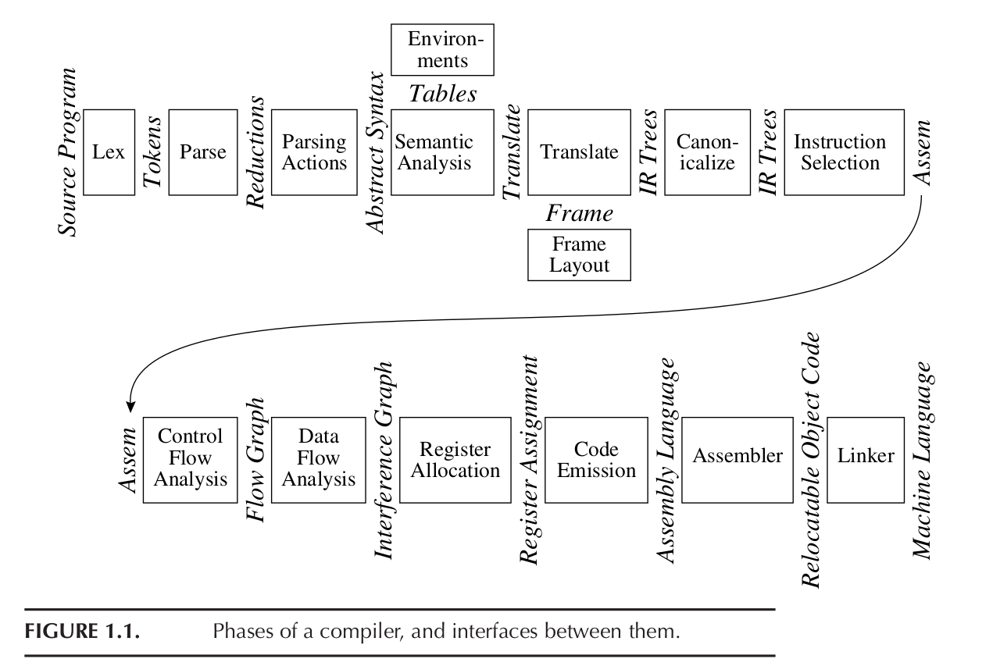

# Humanos e Códigos

#### Para _quem_ a gente escreve?

Aperte a tecla `"s"` para ver as notas de apresentação!

### Oi, eu sou o (Felipe) Bidu!

* [github.com/fbidu](https://github.com/fbidu)
* Instituto de Computação - UNICAMP
* Desenvolvedor na [Ingresse](https://ingresse.com)

# As _maravilhas_ da nossa área

Note:
* Eu vou começar falando sobre algumas características gerais da área de desenvolvimento de software em si.
* Existe um debate se a chamada 'engenharia de software' é ou não uma engenharia
  de verdade e onde ela se encaixa no conjunto de áreas técnicas e científicas
* Seja como for, a nossa área tem uma capacidade que é rara e muito importante

## Introspecção

_A capacidade de resolver problemas de software fazendo *OUTRO* software_

Note:
* A introspecção - a capacidade que nós temos de construirmos softwares que resolvem
  problemas que nós temos no processo de construção de softwares - é um aspecto
  da nossa área que pode passar despercebido por nós mas, quando começamos a
  prestar atenção, ela tá em todo lugar

Note:
* Por exemplo, uma "sprint" nossa por de começar com nós ou algum colega usando
  de softwares como Jira ou Trello para descrever e gerenciar as tarefas que
  precisamos executar dentro do software que estamos autorando

Note:
* Então a gente utiliza outro software como o Git pra organizar nosso código,
  colaborar com outras pessoas, etc

Note:
* Finalmente vai chegando a hora do deploy! Aí nós temos toda uma nova pilha,
  carinhosamente chamada de "stack", de software para lidar. Containers, servidores
  de CI, servidores de CD, os próprios servidores em produção, paineis de monitoramento
  etc, etc, etc

Note:
* No fim de uma feature, uma única pessoa vai ter contato com uma dezena de softwares
  diferentes - tudo para que consiga desenvolver um único software.
* Das nossas IDEs e editores, passando por nossos linters, testers, sistemas de
  automação e etc o nosso código é processado por uma quantidade gigantesca
  de outros softwares ao longo do caminho de desenvolvimento

Isso tudo é ruim?
Note:
* Eu acho essa introspecção, essa capacidade que desenvolvimento de software tem
de olhar para si e usar da própria área de conhecimento para resolver seus problemas,
uma coisa incrível.
* No entanto, essa nossa facilidade em criar softwares novos para resolver problemas
do processo de criação do software pode fazer com que a gente entre num ciclo
vicioso, pensando mais em software sobre software sobre software do que sobre
os outros aspectos do nosso processo criativo como nossos colegas, nosso local de trabalho,
o mercado em que atuamos, as relações éticas cada vez mais complicadas entre
geração e uso de dados pessoais de nossos clientes, entre outras coisas.

Note:
* De fato, com a popularização de computadores, celulares e dispositivos IoT,
as relações entre o mundo digital e a vida física das pessoas se torna cada
vez mais complexa.
* Nós não podemos mais falar de segurança da informação, por exemplo, sem pensar
no impacto bastante real que essas decisões terão na vida pessoal de nossos usuários
* Também não podemos mais discutir sobre a sistematização e o escalonamento de 
certos mercados através de uma solução via software sem considerar as relações
sociais e comerciais que já estavam envolvidas naquele mercado e que com
certeza serão aprofundadas e intensificadas por nossos códigos

[Dieselgate](https://www.ednh.news/vw-dieselgate-fraud-timeline-of-a-scandal/)
Note:
* Em nossa defesa - a nossa área ainda está engatinhando. O primeiro software
comercial foi fabricado no começo da década de 60. Desenvolvimento de software
é praticamente um bebê perto de áreas como a construção civil.
* Por outro lado, essas discussões estão se tornando cada vez mais importantes.
Eu atuo com desenvolvimento de software faz muitos anos, a primeira vez que eu
vi uma discussão séria sobre ética na nossa área foi em 2015, quando descobriram
o Dieselgate da Volkswagen, um software que deturpava testes de emissão de poluentes.
Vocês podem ver mais informações nesse link

Note:
* Tem muita coisa legal e importante para ser discutida entre essas relações
humanos-software mas vamos começar com baby steps.
* Hoje eu quero discutir com vocês particularmente a parte do desenvolvimento de
software que provavelmente é mais próxima do desenvolvedor em si - o código.

Note:
* Vamos começar considerando a pergunta - o quê ou quem é o principal leitor
do nosso código?
* Pode ser tentador responder que o principal "público-alvo" de um código é
um computador. Afinal, escrevemos código para fazer a máquina trabalhar
por nós!
* Por outro lado, nós sabemos que alguns aspectos de um código como uma escolha
concisa de nomes para funções, classes e variáveis, uma formatação bem feita
e coesa, documentação sobre as APIs expostas pelos nossos códigos e etc são
aspectos importantes.

Note:
* O que vocês estão vendo agora é um diagrama geral de um compilador,
com as etapas que um código passa, desde começar ali em cima no canto esquerdo
até chegar em alguma coisa que um computador vai de fato ler, no canto inferior direito. 
* O nosso código em seu aspecto mais amplo só de fato importa pra esse processo
até mais ou menos o terceiro quadradinho. Depois da quinta etapa - "translate" -
nem mesmo a linguagem de programação que a gente usou importa mais. E a gente
não tá nem na metade do caminho até o computador!
* Então eu volto a perguntar, será que o nosso código é feito para ser lido pelo
computador?

Note:
* Hoje, eu vim aqui para defender que não importa o tanto de software que a
gente usa para escrever software, não importa que um processador esteja
no final da cadeia de execução, códigos são escritos para serem lido
sobretudo por seres humanos. Códigos são muito mais próximos de um
romance do que de um

# Ferramentas sozinhas não fazem nada!
Precisamos de **métodos** <!-- .element: class="small -->

Note:
* E finalmente minha última dica é sobre esse monte de ferramentas que a gente tem

* Engenharia de Software é tão legal que ela consegue se introspectar<!-- .element: class="fragment" data-fragment-index="2" -->
* Tem um problema com desenvolvimento de software? <!-- .element: class="fragment" data-fragment-index="3"-->
* Construa outro software pra resolver!<!-- .element: class="fragment" data-fragment-index="4" -->
* git, Jira, pylint, ... <!-- .element: class="fragment" data-fragment-index="5" -->

Note:
* É normal a gente sair de conferências se sentido sobrecarregados de dicas
e ferramentas e técnicas novas

* Ter uma ampla carta de opções é fantástico <!-- .element: class="fragment" data-fragment-index="2" -->
* Nos permite fazer muita coisa legal <!-- .element: class="fragment" data-fragment-index="3" -->
* Mas, especialmente numa equipe, consistência é fundamental! <!-- .element: class="fragment" data-fragment-index="4" -->

* Liste as opções, discuta com a sua equipe e defina um padrão<!-- .element: class="fragment" data-fragment-index="2" -->
* Não se preocupe em definir tudo, não se preocupe em acertar de primeira. Defina
algumas linhas gerais<!-- .element: class="fragment" data-fragment-index="3" -->
* Qual analisador vocês vão usar? Com quais configurações? <!-- .element: class="fragment" data-fragment-index="4" -->
* E então recolha feedback da sua equipe quanto ao uso, modifique seus padrões
se necessário<!-- .element: class="fragment" data-fragment-index="5" -->

* Como de fato _usar_ um analisador estático no desenvolvimento?
* Ferramentas instaladas que não são usadas não servem pra nada!
* Minha sugestão: _hooks pre-commit_ e _CI_
Note:
* Uma questão que fica é como usar de fato essas coisas
* Se você abrir o meu computador e o de muito dev por aí, você provavelmente vai
encontrar um monte de ferramenta X que a gente instalou achando que ia ser
a solução dos nossos problemas e que nunca usamos de fato
* No caso de analisadores estáticos em geral, eu gosto de uma abordagem em duas
camadas, hooks pre-commit e scripts no servidor de CI

### Hooks Pre-Commit
* Códigos que o `git` pode invocar _antes_ de arquivos sofrerem commit
* Recomendo o uso do [pre-commit](https://pre-commit.com/) para gerenciar hooks
* Executam na máquina do desenvolvedor
* Evita que código não-conformante vá para o repositório

Note:
* Eu gosto muito da ideia de hooks pre-commit porque eles são executados antes do
código ser submetido e, caso eles falham, o código não passa
* Isso mantém o repositório limpo pois é preventivo. Você não precisa fazer
um outro commit que vai corrigir alguma coisa que uma ferramenta pegou dps
* O problema de hooks pre-commit normais é que eles não são registrados como
arquivos no git, então é difícil mantê-los de forma igual por toda uma equipe
* Eu gosto bastante do projeto pre-commit porque ele te apresenta uma forma
estruturada de colocar seus hooks dentro do projeto
* Você pode colocar uma execução do seu analisado estático favorito aqui e todo
mundo que mexer no projeto vai ter acesso as configurações

### Servidor de CI
* CI é a prática de manter toda uma base de código íntegra<!-- .element: class="fragment" data-fragment-index="2" -->
* Em geral existe um servidor em algum roda tarefas em cima do código novo como testes e
verificações<!-- .element: class="fragment" data-fragment-index="3" -->
* Eu gosto de colocar todos os analisadores estáticos ali também<!-- .element: class="fragment"data-fragment-index="4" -->
* Evita que um dev que não configurou pre-commit ou não está acostumado com a
equipe viole o estilo que foi combinado<!-- .element: class="fragment" data-fragment-index="5" -->

* Erros no servidor de CI são uma ótima forma de disseminar boas práticas!<!-- .element: class="fragment" data-fragment-index="2" -->
* Ao invés de simplesmente colocar um erro cru, coloque alguma referência sobre
a documentação de boas práticas ou até mesmo o contato de alguém mais sênior
que pode ajudar com o problema <!-- .element: class="fragment" data-fragment-index="3" -->
Note:
* Isso é uma coisa que eu gosto bastante mas não vejo muita gente usando
* Erros no servidor de CI podem ser usados para disseminar as boas práticas
da equipe
* Se as mesmas ferramentas são executadas no pre-commit e no CI e o código de
alguém quebrou por conta de alguma coisa no pre-commit, isso indica que a pessoa
não configurou direito o próprio ambiente
* O erro do CI é uma ótima oportunidade de colocar um texto claro sobre o que aconteceu,
sobre as boas práticas e até mesmo colocar o contato de alguém mais sênior que se
disponibilize a ajudar os colegas nessa situação

# Informação, Segurança & Produtividade
Note:
* Nessa parte da minha palestra eu vou tocar por cima de alguns pontos que eu
acho relevantes nessa discussão

* Desenvolver Software é uma tarefa humana
* Software é feito por humanos, muitas vezes para humanos
* Muitos problemas em Engenharia de Software são problemas de comunicação

Note:
* Uma coisa que muitas vezes passa despercebida é como programação e produção
de software é uma tarefa criativa, lotada de fatores humanos

* Por algum tempo - e algumas pessoas até hoje pensam assim - pensava-se que o
software era uma coisa absolutamente objetiva, livre das "impurezas" dos humanos
envolvidos no seu desenvolvimento

* Isso não poderia estar mais longe da verdade. O desenvolvimento de software é
uma tarefa bastante criativa e que sofre bastante influência dos fatores humanos
no processo

* Muitas vezes, equipes de software enroscam e não conseguem atingir sua eficiência
máxima não por conta de razões técnicas, por que algum treinamento ou conhecimento
está faltando ou coisa assim

* Muitas vezes as equipes acabam sofrendo muito com problemas que são relacionados
com a interação entre as pessoas. Com atritos, com problemas de comunicação,
com ego, com problemas em ouvir opiniões diferentes e etc

* Ferramentas estáveis, que tiram do programador pesos desnecessários são bem vindas  <!-- .element: class="fragment" data-fragment-index="2" -->

* Cada minuto economizado deixando de caçar por erros "bobos" pode ser usado para
fazer outra coisa, trabalhar em outra tarefa, descansar, etc <!-- .element: class="fragment" data-fragment-index="3" -->

* Nenhuma ferramenta é perfeita
* Mas quando adotamos práticas e técnicas que nos ajudam a lidar melhor com o
próprio trabalho, todo mundo ganha

* Existe uma série de problemas de segurança que foram causados por erros tecnicamente
pequenos

* Mas que vieram a existir por conta de programadores cansados, sobrecarregados,
etc

* [Heartbleed](http://www.pl-enthusiast.net/2014/07/01/how-did-heartbleed-remain-undiscovered-and-what-should-we-do-about-it/) [foi um ótimo](https://www.schneier.com/blog/archives/2014/04/heartbleed.html) [exemplo](https://www.zdnet.com/article/heartbleed-open-sources-worst-hour/)

* Type Hinting pode nos ajudar com isso <!-- .element: class="fragment" data-fragment-index="2" -->
* Quanto maior a base de código, mais essa técnica pode se tornar útil <!-- .element: class="fragment" data-fragment-index="3" -->
* Nem ela – e nem nada – vai capturar e evitar todos os bugs <!-- .element: class="fragment" data-fragment-index="4" -->
* Mas dando mais informações de uma forma elegante e organizada, podemos capturar
mais bugs e nos ajudar a cometer menos erros <!-- .element: class="fragment" data-fragment-index="5" -->

# Lembre-se dos humanos
"Mind the human" <!-- .element: class="small -->

* Programar em Python é divertido
* O que fez Python ser o que é somos nós, as pessoas

> Programming is fun again!

― [xkcd 353](https://xkcd.com/353/)

* Na hora de escolher entre técnicas e ferramentas <!-- .element: class="fragment" data-fragment-index="2" -->
* Na hora de revisar o código de um colega <!-- .element: class="fragment" data-fragment-index="3" -->
* Na hora de contratar alguém novo <!-- .element: class="fragment" data-fragment-index="4" -->

# Lembre-se dos humanos!

* Type Hinting ― ou qualquer outra técnica ― ajudam quando elas ajudam os seres humanos por trás do código

Note:
* O legal de uma python brasil é isso - a união da comunidade
* Ontem, por exemplo, eu tive o prazer de me juntar a essas pessoas
fantásticas para jantar e conversar
* E entre tudo o que a gente falou, uma coisa todos nós concordamos que Python é o que é e chegou onde chegou por conta da preocupação com as pessoas
* Isso é uma coisa que todos nós devemos nos lembrar e praticar no
nosso dia-a-dia, na nossa comunidade local, nas nossas empresas, etc
* E eu quero agradecer muito a Carol Willing, Melissa Weber, João
Bueno, Lorena Mesa e Luciano Ramalho por terem também me lembrado
disso
* E eu quero agradecer a todos vocês por estarem aqui e me ouvido nesse tempo. Somos nós quem formamos essa comunidade incrível e somos nós que tornamos tudo isso possível

# Muito obrigado!

* felipe@felipevr.com
* [github.com/fbidu](https://github.com/fbidu)
* Twitter @fevir0