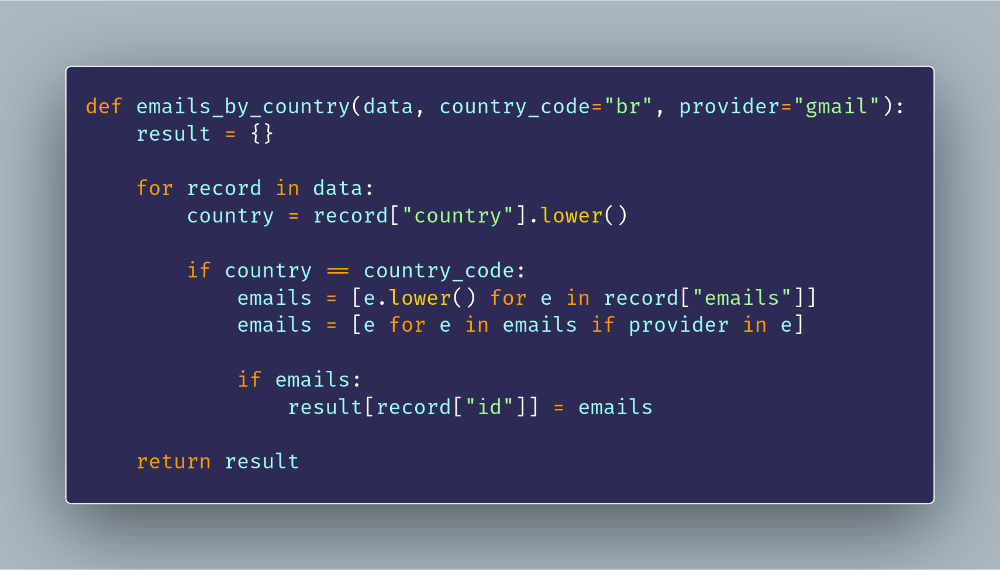
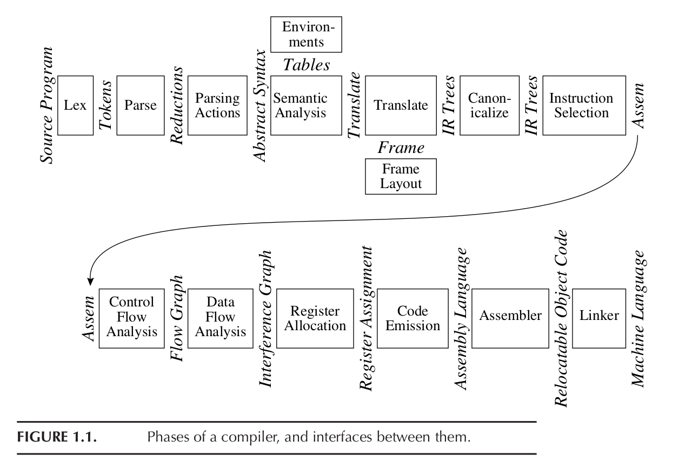
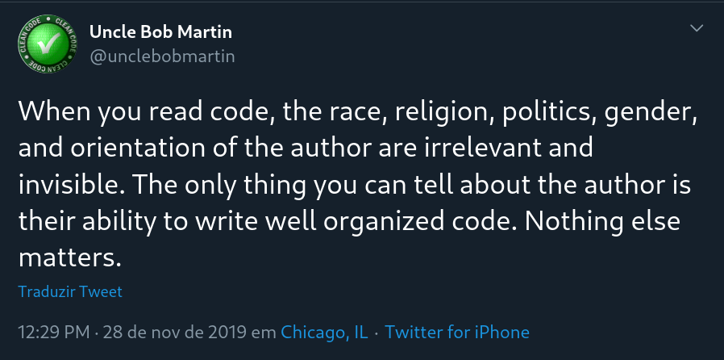
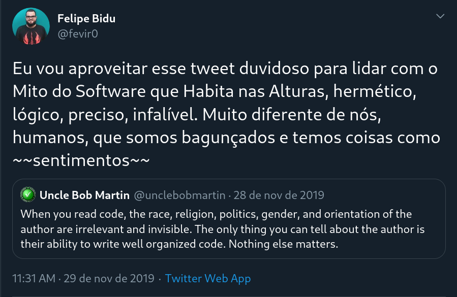
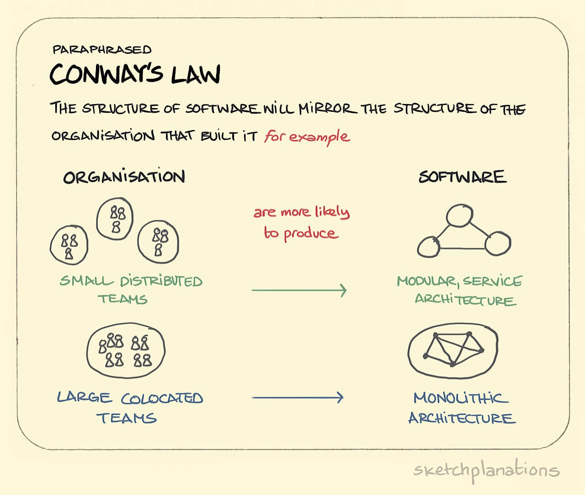

# Humans and Codes

#### To _whom_ do we write?


Press the "s" key to see the presentation notes!


### Hi, I'm (Felipe) Bidu!

* [github.com/fbidu](https://github.com/fbidu)
* Institute of Computing - UNICAMP
* Developer at [Ingresse](https://ingresse.com)


# The _wonders_ of our area

Note:
* I will start by talking about some general features of software development itself.
* There is a debate as to whether so-called 'software engineering' is an "engineering"
  or not and where it fits into the spectrum of technical and scientific areas
* In any case, our area has a capacity that is rare and very important


## Introspection

_The ability to solve software development problems by creating *ANOTHER* software_

Note:
* Introspection - the ability we have to build software that solves
  problems that we have in the software construction process - it is an aspect
  of our area that may go unnoticed by us but, when we start to
  pay attention, it is everywhere


Note:
* For example, a "sprint" of ours may start with us or a colleague using
  softwares like Jira or Trello to describe and manage the tasks that
  we need to run within the software we are authoring


Note:
* Then we use another software like Git to organize our code,
  collaborate with other people, etc.


Note:
* Finally, it's deploy time! Then we have a whole new pile,
  affectionately called "stack", of software to deal with. Containers,
  CI servers, CD servers, production servers themselves, monitoring panels
  etc, etc, etc


Note:
* At the end of a feature, a single person will have contact with dozens
  of different softwares - only so that you can develop one single new software.
* From our IDEs and editors, through our linters, testers,
  automation, etc. our code is processed by a gigantic amount of
  other software along the development path


Is this all bad?
Note:
* I think this introspection, this capacity that software development has
to look at itself and make use of its own area to solve their problems,
an incredible thing.
* However, our ease in creating new software to solve problems
of the software creation process can make us enter a vicious cycle,
thinking more about software on top of software on top of software and so on
than about other aspects of our creative process like our colleagues, our workplace,
the market in which we operate, the increasingly complicated ethical relationships between
generation and usage of customers' personal data, among other things.


Note:
* In fact, with the popularization of computers, cell phones and IoT devices,
the relationship between the digital world and people's physical lives becomes
increasingly complex.
* We can no longer talk about information security, for example, without thinking
about the very real impact that those decisions will have on the personal lives of our users
* We can also no longer discuss the systematization and scaling of
certain markets through a software solution without considering the social and commercial relationships which were already involved in the market and that certainly will be deepened and intensified by our codes


[Dieselgate](https://www.ednh.news/vw-dieselgate-fraud-timeline-of-a-scandal/)
Note:
* In our defense - our area is still in its infancy. The first commercial software
  was manufactured in the early 1960s. Software development
  it's practically a baby when compared to areas such as building architecture.
* On the other hand, these discussions are becoming increasingly important.
I have been working with software development for many years, the first time I
saw a serious discussion about ethics in our area was in 2015, when they discovered
Volkswagen's Dieselgate, a software that distorted pollutant emission tests.
You can see more information on this link


Note:
* There are lots of cool and important things to discuss between these human-software relationships but let's start with baby steps.
* Today I want to discuss with you particularly the part of software development
  that is probably closer to the developer itself - the code.



Note:
* Let's start by considering the question - what or who is the main reader
of our code?
* It may be tempting to answer that the main "target audience" for a code is
a computer. After all, we write code to make the machine work
for us!
* On the other hand, we know that some aspects of a code as choosing
concise names for functions, classes and variables, well done and cohesive
formatting, documentation on the APIs exposed by our codes and etc. are
very important aspects as well.



Note:
* What you are seeing now is a general diagram of a compiler,
with all the steps that a code goes through, from starting up there in the left corner
until you get to something that a computer will actually read, in the bottom right corner.
* Our code in its broadest aspect only really matters for this process
until about the third box. After the fifth stage - "translate" -
not even the programming language that we used matters anymore. And we're not
even halfway to the computer yet!
* So I ask again, is our code primairly meant to be read by a computer?


Note:
* Today, I came here to defend that it doesn't matter how much software we use to
  write software, it doesn't matter that a processor is at the end of the execution
  chain, codes are written to be read mostly by human beings.
* The central issue for me is that software in the sense of a digital product or
  in the sense commonly used within software engineering methods, such software is not a 
  small piece of code written in one day by one person and thrown away on the other.
  They are complex collaborative works in which ideas are materialized _through_ code.
* In software like this, the code acts as a means of communicating abstract concepts
  thought by a colleague, shared to others and developed collaboratively by many.
* Before a code falls into a deployment pipeline that will take it to production,
  it has passed through several very human eyes and hands again and again.
  Forgetting or failing to pay attention that one of the main roles of a
  code is to serve as a means of communication between us and our colleagues can
  led us to wrong choices when judging which processes and tools to use, how to
  organize our work, what to evaluate when reviewing pull requests, among other
  things. After all, if the main purpose of the code is not well understood,
  how are we going to properly optimize its process of creation?



Note:
* You may not be putting much faith in my central argument, that
there is an intricate relationship between our code and the quite human components 
of software development
* You might think like some colleagues that claim "when you read code only the code
  matters!"



Note:
* My 100% personal answer to this very dubious claim from Robert you can read later
on my Twitter, it is in brazilian portuguese but I've heard that the twitter
translator does a good job on what I've written
* In short, I am not a big fan of this vision of The Software, with capital letters,
  as being this clean, sanitized entity free of the problems and biases of humanity
  and so on.
* In the case we are dealing with today, there is another observation that I think
more relevant



Note:
* This observation is called Conway's Law. It is not a law in the scientific sense
of the term, but it is an observation that has proved to be valid over several
tests since the 60s
* Conway's law says that software created by an organization tends to have a
structure that mirrors the internal communication structure of that organization
* That is, a company that has an extremely hierarchical structure and
divided into layers will have difficulties in building an architecture based on
microservices, since this architecture demands a more free communication, based
on small autonomous groups
* At this point we start to notice how the form of communication between us,
developers, with the rest of our company is marked in our software
* If you want to reorganize your company's software's structure,
for example migrating from a monolithic layered architecture to a microservice architecture,
as it is in fashion, it is very likely that focusing only on the architecture
of the code itself without thinking about how people communicate in general
will cause tension in this structure - you will force the software into a path
that does not find a mirror in the way the company is organized.
In this situation, we can use Conway's Law to our advantage and,
instead of making a passive observation of how software structures follow
social structures, we can initiate a change in the social aspect to then favor
a change in the software structure.


## Code Communicates Ideas
Note:
* An important point in this discussion is the view that the code acts like this
  media for transmitting ideas.
* When considering the code in this way, we begin to observe certain patterns of
  use


```python
def test_new_feature():
  """
  What if we added this flag?
  """

  assert our_software.proposal(test) == "hey yo!"
```
Note:
* Whoever uses TDD or participates in Code Dojos may be more
  familiar with that vision. Do you want to propose something new in a piece of code?
  How about writing a test - which will fail - demonstrating the behavior
  you expect? Perhaps this will provide a clearer view of what you
  intend than if you tried to explain it without a code.
* This is a strategy that I particularly use in open source projects. The
  discussion starts with a pull request that implements a failed test. That
  test will work if the idea is implemented. From there, we can discuss many
  cool things!


```python
# Sum a with b in x
x = a + b

# Prints x
print (x)
```
Note:
* A point of debate when it comes to code are comments. There are many
  possible approaches here.
* One that is relatively famous is that your code should be obvious
  so obvious that it needs no comment. I think this approach is
  interesting in theory but not always feasible and may actually be
  counterproductive
* Writing code full of "gotchas" and exotic uses of the language
  is bad and compromises readability but, at times, we need to
  make use of more complex structures. Trying to rewrite these structures
  'obviously' makes as much sense as writing a doctoral thesis
  using only the 100 most common words in the English language. You're going
  to end up with an extremely wordy text that fails to clearly represent what
  you mean


> Do not write in the comments anything that the code itself clearly says
Note:
* One suggestion I give is that you take a look at your code and think if
  it is straightforward enough. Does its behavior depends on collateral effects
  or global states that are not obviously displayed in the code? Does it _cause_
  effects or changes in those states that will reverberate through the system? Those
  are good examples of where a comment is very much welcome.


## Documentation != Comment
Note:
* In the same discussion on comments there is another point of debate which is
  documentation. Basically a person who is going to use a function, class,
  module, method, etc., shouldn't need to read the code itself to use
  the ideas encoded in that structure
* Although the source code for these elements is the implementation of the idea itself,
  good documentation can help a lot in the collaborative effort


> But _what_ to document??


``` python
def fibonacci(n, cache = None)
    """
    Calculation of fib. recursive starting from n = 0 and
    going up to the maximum possible recursion.
    Accepts a dictionary as a cache. If the cache
    is empty, it is not used!
    """
```
Note:
* Again, many different schools of thought, many different guides, etc.
  Consider this function in Python and its docstring "Recursive fib calculation.
  starting from n = 0 and going up to the maximum possible recursion. Accepts one
  dictionary as cache. If the cache is empty, it is not used! "
* Well, it's definitely a stuffed docstring! But put yourself in the place of
  a colleague who's using the fibonacci function. That person doesn't need to know a
  lot of things that is happening there! The fact that the strategy is recursive is
  hardly an information important enough to be placed at the top, the question of a
  empty cache not being used is pretty obvious too
* Anyway, in this case, the strategy I like to use is to write what the main objective is
  in a sentence or two. So, it's nice to describe the arguments and maybe some usage example. It is also important to document whether the behavior that function will vary according to global states or if it changes them. Implementation details, about how that function does what it says it does are unnecessary in the documentation.


### Code reviews are the opportunity to join codes and humans!
Note:
* A practice that I consider extremely important in any team are
  code reviews. They are the opportunity for a person to look at the code
  of each other and debate what's going on.
* After all, assuming that one of the intentions of the code is communication
  of ideas, only another human being can actually give us a parameter
  whether our code is fulfilling its role or not
* Besides the obvious, more people looking at the code, more chance of bugs being solved


> Code reviews help align the "obvious"
Note:
* In the previous topic I talked a lot about 'not documenting the obvious', 'not putting
  comments on what the code already clearly says', but 'obvious' and 'clear'
  are very relative things and they may not mean the same thing for everyone.
  Code reviews help with that
* There's nothing better than another developer to judge if your documentation
  is in fact clear. Each team has its own dynamics but I think it's very important
  that documentation deficiencies are reason enough for a pull
  request to be held pending further modifications


> Code reviews allow the team to reassess practices, tools and techniques
Note:
* Besides that, code reviews are a moment that the team can use to ponder
  if the way things are being executed and if the tools that are being used
  are actually serving the code's authors! Is that CI rule correct? Do we need to
  revise the rules of linter? Are they fulfilling its role as aids on the process
  or are they becoming a burden? A code review can be a good time to deal with it


> Remember that APIs are INTERFACES
Note:
* APIs are common structures in a modern architecture. But when we think or
  discuss APIs we often jump right into things like REST, HTTP verbs and JSON
  structures
* Let's revisit the concept of API as an interface


> inter **face** = a **face** (front, facade) between two or more things
Note:
* The English term "interfeice" is usual and correct but I think the term more
  aportuguesado "interface" allows us to better see an interface like it
  it really is - a point of communication between two or more faces, between two or
  more different entities, each with its own functionalities.
* And again we are in the middle of a communication problem. APIs before they deal
  with code problems, before they deal with implementation issues they
  deal with a communication issue between a side that offers a certain resource
  and another side that uses this resource
* Code that perfectly implements an API but does not offer any form
  potential customers to discover its functionality and understand how
  using them, it does its job only partially.
* If you work for a company that has a back-end team and a team of
  front-end working together, it is very easy to remember the 'interface' aspect
  of an API, but it can also be very tempting to communicate what a certain
  endpoint does by informal means. Slack message, audio on whatsapp,
  pass a post-in with the specification ... What about the next team members?
* Remember the code as a means of communicating ideas! Use and abuse of tools
  of automatic documentation!


[OpenAPI Initiative] (https://www.openapis.org/)

[OpenAPI.Tools] (https://openapi.tools/)


## Paradigms & Fluency
Note:
* Now entering two slightly more abstract concepts we have the notion of
  paradigms and fluency.
* A paradigm is a way of seeing the world, a way of abstracting the world to
  within the code. If you program imperatively, for example, you
  sees your problem as a declaration of states and orders for change
  of state. If you program with object orientation, you see your problem
  as being composed of entities that have hierarchical relations, inheritance
  and composition between them.


! [: scale 50%] (paradigms.jpg)
Note:
* Each box in this photo is a different paradigm. For our conversation
  today the observation that I think is most important to make is to remember that a
  paradigm is not tied to a language and vice versa. If you program Java,
  declaring a single Main class and writing your entire system in there,
  you did anything but object-oriented programming
* Natural languages ​​like Portuguese and English also "print" paradigms
  in our minds.
* Similarly, to know a little more about other paradigms besides those
  our usual ones, can help us to see a problem from different angles,
  helping us to think of new solutions


`` python
@dataclass
class Sudoku:
  grid: np.array

  @classmethod
  def from_string (cls, raw):
    values ​​= []
    for digit in raw:
      values.append (int (digit))
    grid = np.array (values, dtype = 'int64'). reshape ((9, 9))
    return cls (grid)
``
[Python Multiparadigma] (https://github.com/eliasmistler/europython2020-multi-paradigm-sudoku)
Note:
* And many languages ​​today actually support multiple paradigms. It is worth noting
  that 'supporting multiple paradigms' is about giving facilities to use
  the structures of a paradigm. You can do something object-oriented
  in C, but the language itself doesn't give you anything special to do that.
* I will not go on too long in this example, the link is there for those who want. Was
  a very interesting talk from EuroPython that year. Here you are
  seeing an object-oriented Sudoku. The from string function takes a sudoku
  described as a big text and creates the grid


`` python
def parse_raw (raw):
  return np.array (
    list (map (int, raw)),
    dtype = 'int64'
  ) .reshape ((9, 9))
``
Note:
* Here, on the other hand, you have a very functional approach. A procedure
  unique, without side effects, without making assumptions about the use case, that
  it simply takes one data entry and returns another.


`` python
def parse_raw (raw):
  size = int (math.sqrt (len (raw)))
  return np.array (
    list (map (int, raw)),
    dtype = 'int64'
  ) .reshape ((size, size))

class Sudoku:
  @classmethod
  def from_string (cls, raw):
    values ​​= parse_raw (raw)
    return cls (values)
``
Note:
* And finally, we have a multiparadigm approach. Object-oriented on the side
  that makes sense, but using features that are very compatible with programming
  functional at another time.
* If your language supports these facilities, it can be a great idea!
  Note, for example, how the for loop of the first solution is gone!


`` c
for (i = 0; i <10; i ++) {
  if (list [i]% 2! = 0) {
    return 0
  }
}

return 1;
``
`` python
for i in range (10):
  if list [i]% 2! = 0:
    return False

return True
``
Note:
* Programming languages ​​as well as natural languages ​​also suffer from the issue
  of fluency. We "program with an accent"
* When you learn a new language, like English, you learn that 'table' is
  'table', so when you look at a table, you think 'table' and mentally translate
  for 'table'
* The process works, of course, but it has two important limitations: it is more
  slower than you associate 'table' with the object itself. Furthermore, with a process
  what do you think in portuguese and then mentally translate into english,
  you will never use expressions and words that are unique to English,
  because they have no equivalent in Portuguese
* In programming we write code with an accent when we think of the code
  first in our "native programming language" or the most used and then
  we mentally translate the code into the target language
* Here we have an example of this, a C code that checks if all
  list elements are even, translated "literally" into Python


`` python
for i in range (10):
  if list [i]% 2! = 0:
    return False

return True
``
`` python
for i in list:
  if i% 2! = 0:
    return False

return True
``
`` python
all (i% 2 == 0 for i in list)
``
Note:
* The translated code literally works, but in Python the for loop can
  iterate right through the list. The second solution is a more usual approach.
  Finally, in python we have the ʻall` operator which, along with another feature of
  language called list comprehension, will give the last solution. That last
  solution is the most usual in Python and someone who programs Python thinking first
  in another language and translating, it probably wouldn’t reach it. Unless,
  of course, that the 'other language' is Haskell, which is where Python was inspired
  to have this syntax
* Fluency is something that we acquire over time, but it is important to know that
  this concept applies to both natural and programming languages.
  Unfortunately I don't know a generic formula for this, in Python we
  has the great book "Python Fluent". In general, try to ask yourself 'what does this
  language is special? What does she have that I have never seen? ' this is a good path


# Tools and Processes
Note:
* And finally we're back where we started, introspection! How to look
  for the entire zoo of tools we have available and look at them
  thinking about the ideas we discussed today
* As you can imagine, there is no closed and unique answer! What we can
  to do is follow some principles that can help us make decisions


* Having a wide range of options is fantastic <! - .element: class = "fragment" data-fragment-index = "2" ->
* It allows us to do a lot of cool stuff <! - .element: class = "fragment" data-fragment-index = "3" ->
* But, especially in a team, consistency is key! <! - .element: class = "fragment" data-fragment-index = "4" ->


* List the options, discuss with your team and set a standard <! - .element: class = "fragment" data-fragment-index = "2" ->
* Don't worry about defining everything, don't worry about getting it right the first time. Define
some general lines <! - .element: class = "fragment" data-fragment-index = "3" ->
* Which analyzer will you use? With what settings? <! - .element: class = "fragment" data-fragment-index = "4" ->
* And then collect feedback from your team on usage, modify your standards
if necessary <! - .element: class = "fragment" data-fragment-index = "5" ->


> Git hooks & CI servers
Note:
* I quite like to plug these tools into one of two moments - hooks
  and CI. Or even both!
* Pre-commit hooks are executed before a commit and are useful for
  we keep the repository free of non-compliant code. The CI for its
  instead it is useful to run automated tests and etc.
* Anyway ...


# Remember humans
Note:
* This is the most important point of our chat today! If you are going to put a
  CI server that will check if the code matches the style, for example,
  why not add in the error message the contact of someone on the team who can
  help with that programming language? Something like 'look, your code
  failed here. Did you install your pre-commit hooks? The instructions are here.
  If you have problems, talk to bidu at bidu @ etc '
* Remember that the CI server, the linter, the hooks they are not there to serve
  to the code, not to serve the processor, not to please me or anyone
  another speaker, motivational coach or whatever. They are there to serve
  the authors and readers of that code and if they don't make these people's lives
  easier, they are not fulfilling their role properly. Don't accept that
  an assistive technology works "ok". We have a sea of ​​resources available
  for us and these software should serve us!


# In short...
* Computing is increasingly intricate with our society and new complexities arise from it <! - .element: class = "fragment" data-fragment-index = "2" ->
* Computing introspects - software is used to make software that is used to make ... <! - .element: class = "fragment" data-fragment-index = "3" ->


* Code is a means of communicating ideas between us <! - .element: class = "fragment" data-fragment-index = "2" ->
* Tests, documentation and comments are ways to "expand" the communication power of a code <! - .element: class = "fragment" data-fragment-index = "3" ->
* Code reviews are an important time for the team to discuss the work <! - .element: class = "fragment" data-fragment-index = "4" ->
* Documentation and comment failures should be considered in the review <! - .element: class = "fragment" data-fragment-index = "5" ->


* APIs are, first and foremost, interfaces <! - .element: class = "fragment" data-fragment-index = "2" ->
* A hidden "face" is not very usable - document! <! - .element: class = "fragment" data-fragment-index = "3" ->


* Use of introspection! Use the tools! Automate what you get! Leave humans with the creative part <! - .element: class = "fragment" data-fragment-index = "2" ->
* But don't be afraid to throw the tools away. Remember that they should serve US and not the other way around <! - .element: class = "fragment" data-fragment-index = "3" ->


# References

[The Language of Programming] (https://www.deconstructconf.com/2018/anjana-vakil-the-language-of-programming)

[John Ousterhout: "A Philosophy of Software Design" | Talks at Google] (https://www.youtube.com/watch?v=bmSAYlu0NcY)


# Thank you very much!

* felipe@felipevr.com
* [github.com/fbidu((https://github.com/fbidu)
* Twitter @ fevir0

