# Infra ― Histórias Reais

Aperte a tecla `"s"` para ver as notas de apresentação!

### Oi, eu sou o (Felipe) Bidu!

* [github.com/fbidu](https://github.com/fbidu)
* Instituto de Computação - UNICAMP
* Desenvolvedor na [Ingresse](https://ingresse.com)

# O Poppin

Note:
* Pra começar a nossa jornada, vamos começar entendo o que exatamente era o Poppin

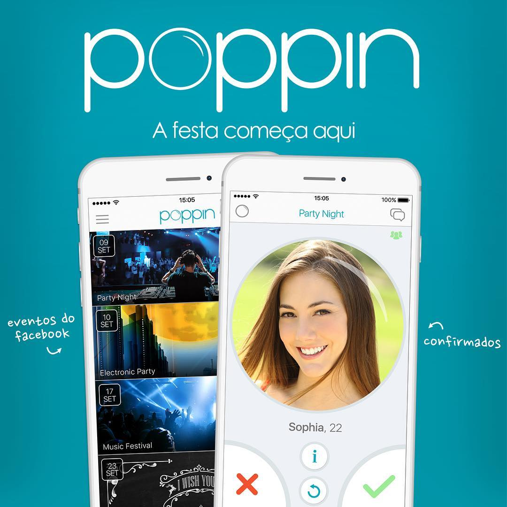

Note:
* O Poppin em sua origem, em 2015-2016 era um aplicativo de paquera voltado
para eventos
* A mecânica era assim - você fazia login com seu facebook, nós listávamos
seus eventos. Quando você clicava em um evento, você via as outras pessoas do
poppin que iam estar lá também. Então você podia dar 'like' ou 'dislike' nela.
Caso vocês dessem like um no outro, vocês tinham dado 'match'. Um chat se
abria para vocês conversarem e combinarem de se encontrar.
* Esse fluxo resolve alguns problemas importantes que se você já usou um dating
app você conhece.
* Primeiro, em dating app rola muito isso das pessoas ficarem 'vamo marcar', 
'noossa, vamo marcarr' mas ninguém acaba marcando. Como você e a pessoa já
iam ao evento, o atrito de 'marcar o primeiro encontro' é bastante reduzido
* Inclusive o nome poppin e o logo da bolha de sabão vem disso. Ele ajudava você
a 'estourar a bolha'
* Depois tem a questão da segurança; Você pode achar suuuper charmoso aquele
barzinho escondido no meio da mata local que só tem duas mesas, mas você
provavelmente não vai marcar um encontro com uma pessoa desconhecida lá. Uma
festa com mais pessoas também resolve esse problema.
* E por fim tem a questão de que você não vai precisar se arrumar e etc pra sair
com UMA pessoa que pode ser, bem um #dateruim. Você vai numa festa, se seu date
for um pé no saco, você tem uma festa inteira de possíveis dates.

Note:
* A ideia original do Poppin veio de dois amigos de São Paulo. O Guilherme, que
é o que tá de paletó preto nessa foto e era o CEO do Poppin e o Filipe, que tá
em primeiro plano de camisa branca e era nosso CMO, o chefe de marketing.
* Depois de juntarem um dinheiro inicial, saíram em busca de alguém para
desenvolver a ideia

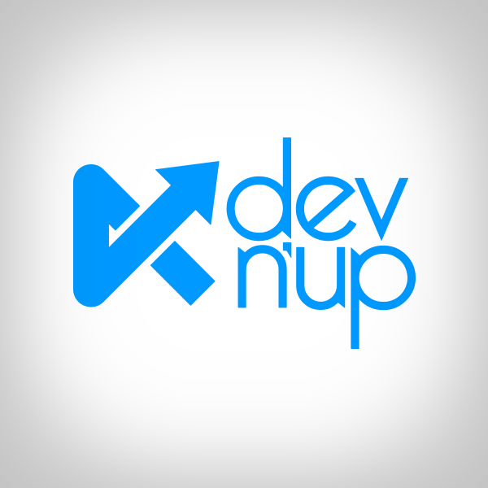
Note:
* E aqui em campinas eles encontraram a Devnup. A Devnup era uma empresa de 
software que na época era formada só por alunos daqui da computação e tinha
um modelo de 'software house' que é uma empresa que faz softwares sob
encomenda
* Foi lá que o Poppin foi construído inicialmente e foi na Devnup que ele
funcionou por mais ou menos o primeiro ano dessa história. Mais sobre isso
em breve

# API? Back-end? Front? Infra?

#### A sopa de letrinhas da computação "moderna"
Note:
* Pra gente começar a conversa sobre infra mesmo, eu vou definir alguns conceitos
que são importantes
* Nessa palestra, eu não assumo conhecimento prévio praticamente nenhum, então
eu vou dar uma definição informal de alguns pontos
* Por outro lado, na hora das perguntas, fiquem a vontade pra perguntar coisas
mais técnicas caso vocês queiram!
* Bom, existe uma série de termos que são discutidos em situações assim. Eu coloquei
aspas ali no computação "moderna" porque muitas dessas coisas se comporta como
moda. Elas entram na moda, elas saem de moda, elas são redescobertas e então
elas se tornam 'brega' de novo e então elas são revisitadas e etc até que você
se vê com uma calça boca-de-sino programando microsserviços achando que você
tá sendo suuper futurista quando, na vdd, vc tá revisitando um conceito antigo
que foi deixado de lado por um tempo e voltou a ser relevante porque fez
sentido, porque alguém viu e gostou, etc.

## Front-End
* Parte mais próxima do usuário
* É o que roda no seu navegador, celular, etc
* Responsável por ler interações do usuário, enviar para o "servidor",
coletar a resposta do servidor e formatá-la para o usuário

## Back-End
* É o código que roda no "servidor"
* É responsável pelas lógicas de negócio mais pesadas
* Normalmente possui comunicação com bancos de dados e afins
* Roda em máquinas controladas pela empresa, e não pelo usuário

## Exemplo no Poppin

* _Front_ 📱: Pede ao back uma lista de pessoas em uma festa
*  _Back_ 🖥️: Calcula quem são as pessoas naquela festa que são relevantes para o
usuário. Por exemplo, o usuário podia escolher a faixa etária e gênero das
pessoas que queria ver
*  _Back_ 🖥️: Envia a lista de pessoas para o front

* _Front_ 📱: Formata a lista, carrega imagens, exibe botões de 'like', 'dislike'
* _Usuário_ 💁 : Clica em 'like'
* _Front_ 📱: Captura a ação do usuário e conta para o back end que o usuário A
deu 'like' na pessoa B

* _Back_ 🖥️:  Avalia se a pessoa B já deu like em A. No caso sim! Então o back conta
para o front que A e B deram 'match'
* _Front_ 📱: Mostra animação "✨✨Match✨✨ 🚀"
* _Front_ 📱: Mostra o chat

### Legal, mas e a infra?!
Note:
* A infra é a área responsável por cuidar de toda a estrutura que sustenta
o back end, os bancos de dados necessários, a comunicação de rede necessária
* Também auxilia o time de back-end na hora de escolher tecnologias que vão
entrar em "produção"

### Produção?
Note:
* No desenvolvimento de software, normalmente nós dividimos os servidores que
estão rodando código em 'ambientes'
* O ambiente de desenvolvimento roda uma cópia do código do back-end que está
sendo trabalhado ativamente naquele momento
* O ambiente em produção, por outro lado, roda o código que está ativamente
se comunicando com os usuários
* Colocar uma tecnologia "em produção" é uma decisão que precisa ser feita com
cuidado, uma vez que tudo o que roda nesse ambiente vai ter impacto direto
na experiência do usuário e também vai precisar receber manutenção ao longo
do tempo. Muito do trabalho em infraestrutura envolve equilibrar isso -
por um lado você quer colocar coisas novas no ar para ganhar vantagem
competitiva, pra oferecer mais coisas ao seu usuário mas, por outro
lado, você também tem que ter cautela. Não existem respostas
definitivamente certas e é necessário diálogo entre todo
mundo envolvido pra chegar em alguma decisão que faça
sentido

Note:
* Quem usa git e afins tá familiarizado com o conceito de 'branches' que guardam
o estado de um código
* Normalmente existe um pareamento entre branches e ambientes. Vocês tão vendo
um print real de um projeto. A branch 'dev' é colocada no ar no ambiente
de desenvolvimento e a branch 'main' no ambiente de produção
* A branch ali no meio 'add-sentry-config' é uma 'feature branch', uma branch
que saiu de dev pra eu implementar alguma coisa nela. Ela então é 'fundida' de
volta em dev. Algumas empresas gostam de dar deploy em feature branches também,
eu particularmente nunca trabalhei assim

### Deploy, CI & CD
#### Colocando coisas no ar!
Note:
* Suponha que seu código tá pronto, tá na 'branch principal' e, portanto, deve
ir pro ambiente em produção! Como que isso acontece?
* Esse processo é o processo de deploy. Deploy é literalmente o ato de distribuir
o seu código pros servidores em produção de forma que ele fique disponível pra
seus usuários
* Meu primeiro emprego como desenvolvedor foi em 2008. Nessa época era bem mais
comum colocar as coisas no ar em grandes lotes. Algumas empresas, se não me engano
a minha era assim, fazia isso num certo prazo como 'uma vez a cada dois meses'
outras, executavam o projeto 'inteiro' até um certo ponto e só então colocavam
no ar
* Isso causa todo tipo de problemas. A raíz da maioria deles é o ciclo extremamente
longo de feedback. Você escreve um código hoje e só vai ter certeza que ele opera
bem com o código de todos os seus outros colegas meses depois. Quando aparecia
um problema você nem lembrava mais do seu código

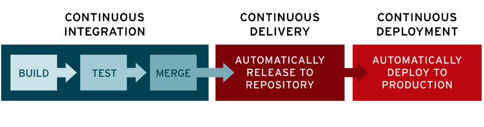

_[Integração e entrega contínuas: pipeline CI/CD](https://www.redhat.com/pt-br/topics/devops/what-is-ci-cd)_
Note:
* Atualmente é mais comum ciclos automatizados de integração, entrega e deploy
* Em resumo o processo de CI, a Integração Contínua possui etapas que rodam
automaticamente para garantir que o seu código e o resto do projeto estão
saudáveis e funcionais
* A entrega contínua garante que o código fica pronto pra ir pro ar de maneira
automática, mas a colocação dele de fato no ar ainda é manual
* E finalmente no deploy contínuo o código vai pro ar de maneira automática,
desde que ele passe com sucesso nas etapas anteriores como compilação e testes

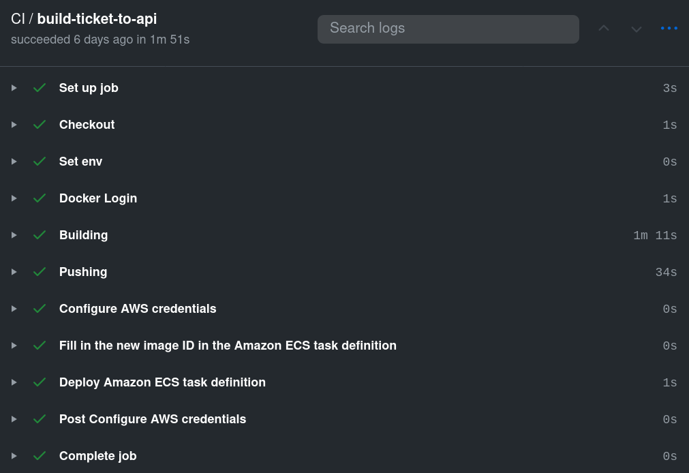

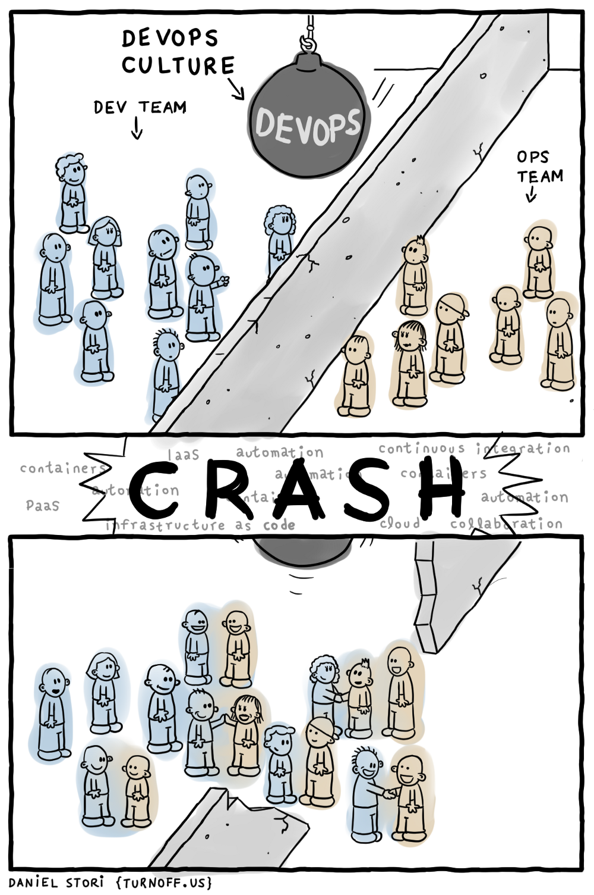
Note:
* devops como integração, não como cargo; É uma cultura

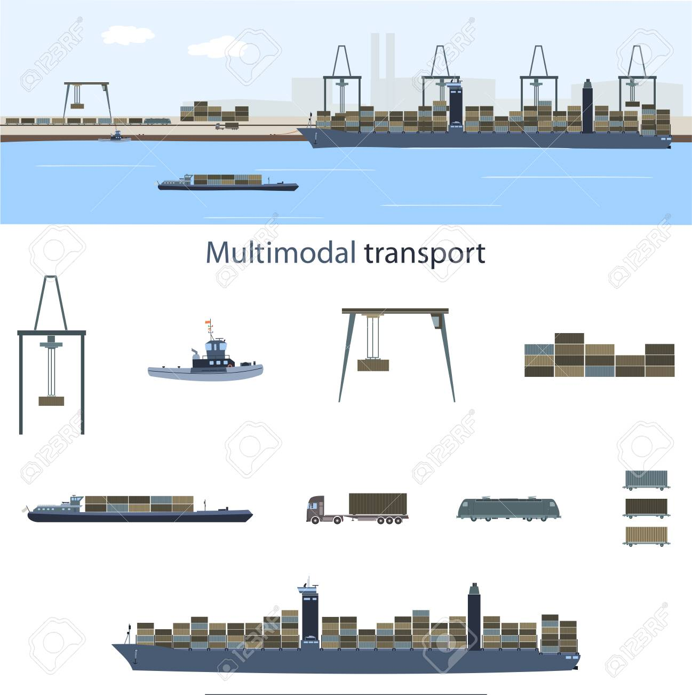
Note:
* E finalmente um último conceito que é legal da gente ver aqui é o de container
* Desde o começo o back end do poppin é feito em containers
* Mais resiliencia, escalabilidade, etc

# 2016
#### 1º Deploy Real Oficial (tm)

* 1º deploy em produção, em Junho
* Infraestrutura 100% integrada à Devnup
* Primeiros 100k usuários
Note:
* Nessa época, eu e todo mundo da equipe técnica éramos da devnup
* Infra da devnup como um cluster compartilhado entre todos os projetos da época
* Todos os processos do Poppin de dev passavam pela devnup
* A infraestrutura na época era bem complexa. Na verdade eu acho que ela nunca
foi tão complexa pq o poppin não existia sozinho no servidor, ele compartilhava
com outros projetos
* Pra tornar isso possível uma coisa que a gente fazia na devnup era colocar tudo
em container. Todos os projetos eram embrulhados em containers dockers
* Não vou pular muito nos detalhes técnicos aqui mas a gente orquestrava tudo isso
usando um sistema operacional distribuído conhecido como DC/OS
* Abstrai várias máquinas em uma, (resumir arquitetura distribuida, middleware, etc)

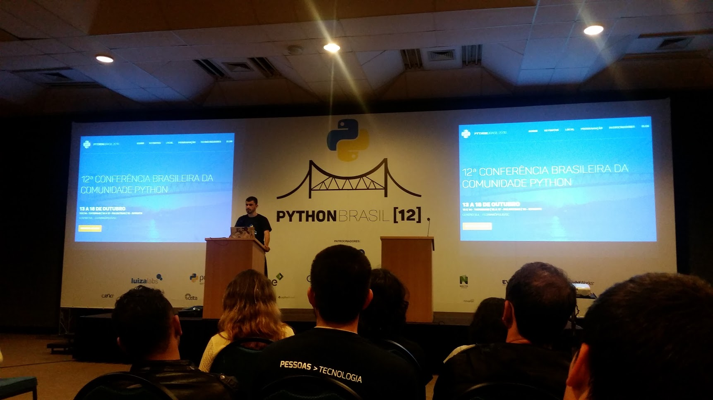

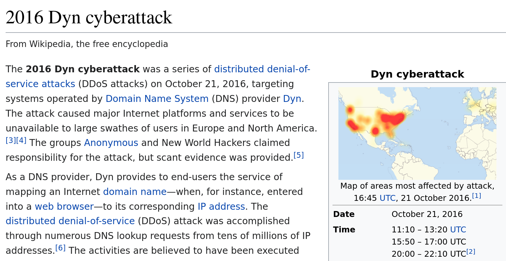
Note:
* (resumir ddos)
* (cloudflare)
* (arquiteturas com multiplos pontos de disponibilidade como Netflix resistem melhor)

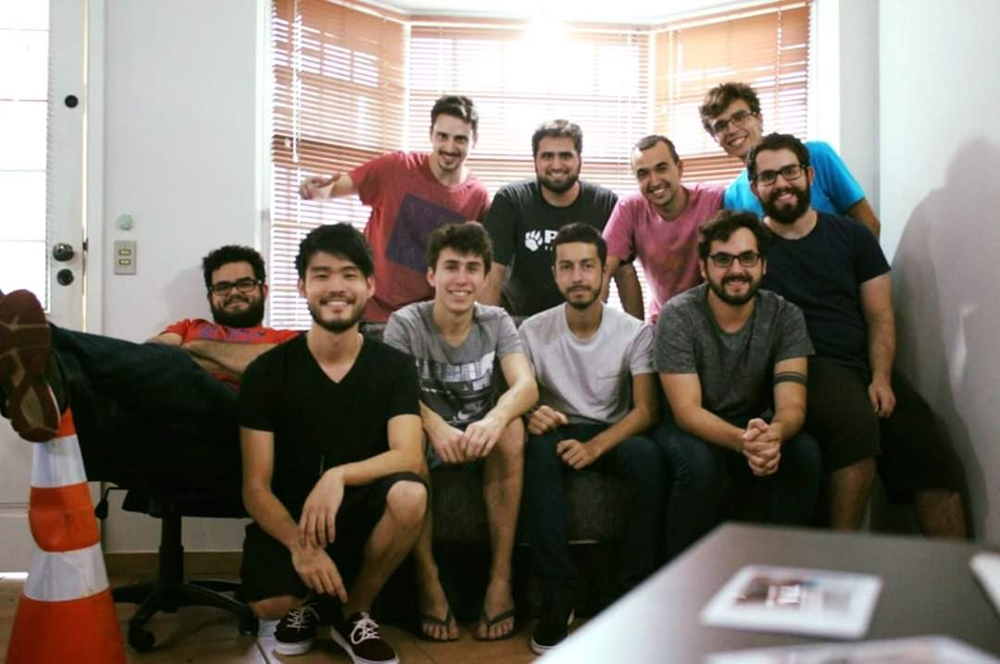

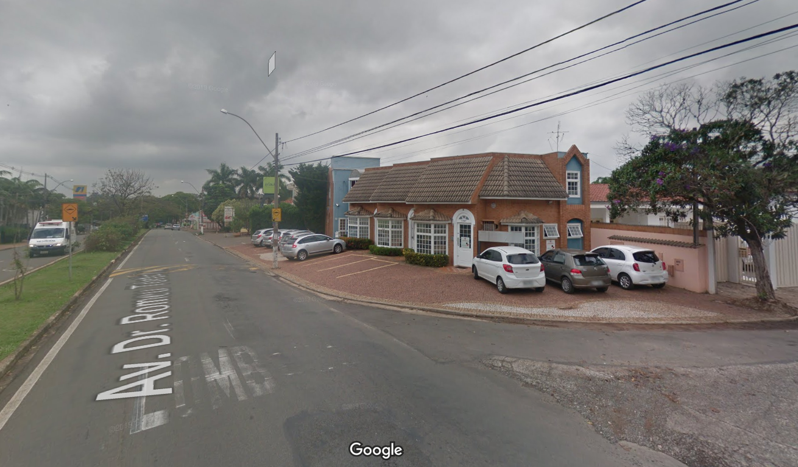

# 2017
#### Spin off!
Note:
* No começo de 2017 tava claro que o poppin precisava de uma equipe dedicada
* Num acordo entre Devnup e Poppin, eu e outros colegas que eramos da devnup
e trabalhávamos no Poppin recebemos propostas para compormos a equipe do poppin

Hora da mudança!
Note:
* Infra nova!
* Um cluster grande não fazia sentido pro poppin e a gente precisava separar as
contas de infra das duas empresas
* Nesse bolo também ganhamos um monte de créditos da AWS que era nosso provedor
de computação em nuvem como parte do nosso programa de aceleramento pela ACE
startups

[Fonte](https://mycloudblog7.wordpress.com/2013/06/19/who-manages-cloud-iaas-paas-and-saas-services/)
Note:
* Migração de containers em um cluster gerenciado por nós para o Elastic
Beanstalk

## Produção:
* AWS
* Elastic Beanstalk
* MongoDB
* Redis
Note:
* (explicar sobre REDIS e cacheamento de token)

## Servidor de Staging!
Note:
* Servidor que simula o ambiente real de produção

## Dev:
* Heroku

## Imagens e Afins:
* Bucket S3 em São Paulo
* Sem cache, sem CDN
Note:
* (explicar sobre armazenamento estático não ficar no banco)
* (o que é uma CDN e um cache)

Crédito$$ da AW$
Note:
* muito crédito, muito bom pra testar coisa; risco de vendor lock-in
* em geral deu tudo certo mas precisamos rever a politica de cache e CDN dps

Note:
* Mudamos para o terracota

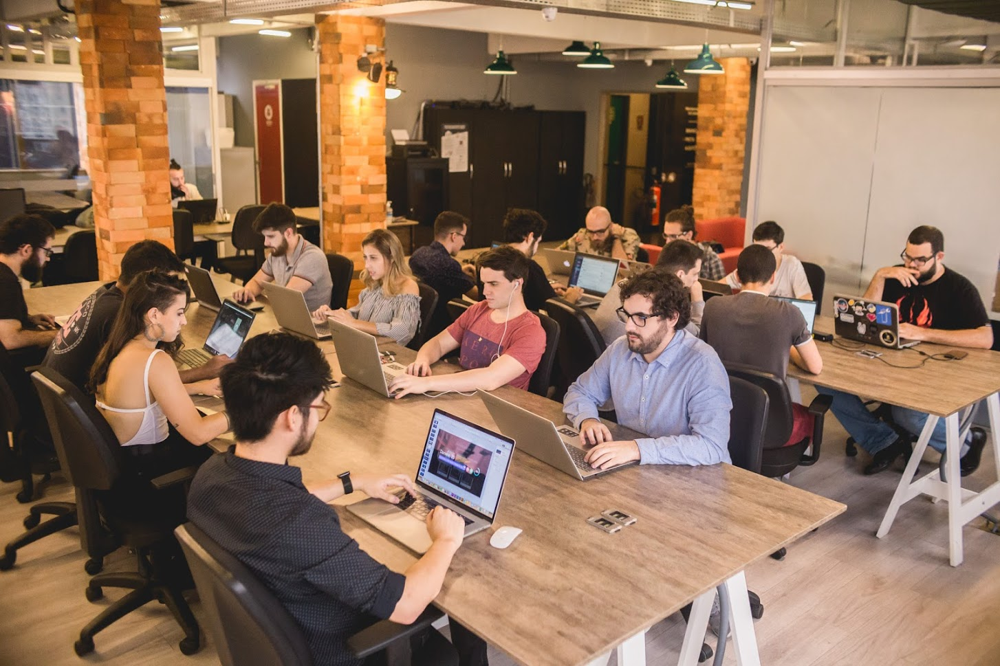
Note:
* Sempre tivemos um escritório em SP e um em Campinas

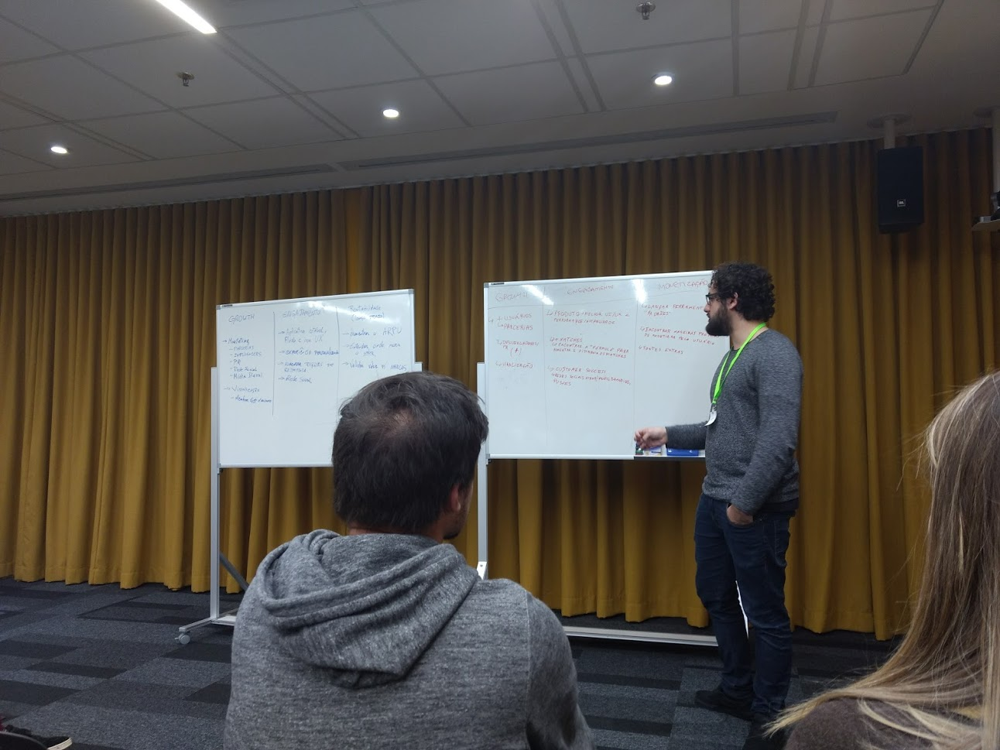
Note:
* Começamos a usar OKR para fazer planejamentos trimestrais de toda a empresa,
parte técnica, comercial, marketing, etc

# 2018
#### Mudando tudo!

Note:
* 2018 começou com um bug bem misterioso. Nossa aplicação em back end começou
a perder performance muito rápido, sem que nenhuma grande mudança tivesse sido
feita
* (explicar new relic, logs)

## Mas o pior ainda estava por vir...

Lembram que o Poppin usava dos eventos do Facebook na sua mecânica?

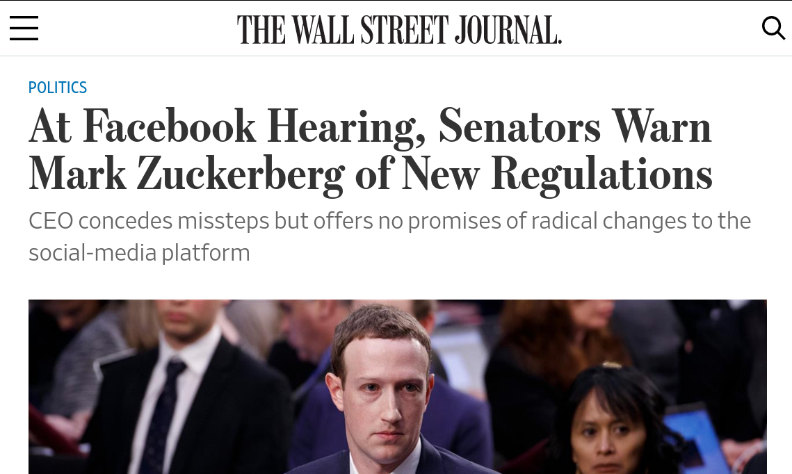
Note:
* Então...
* Falar do cambridge analytica

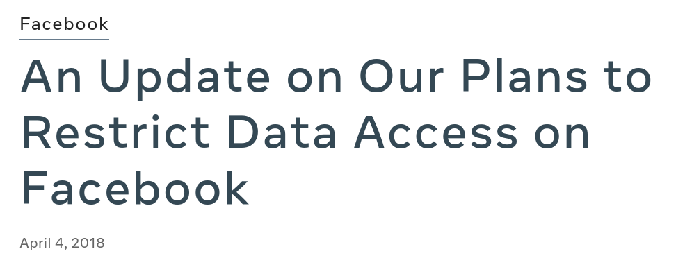

> Starting today, apps using the API will no longer be able to access the guest list or posts on the event wall. And in the future, only apps we approve that agree to strict requirements will be allowed to use the Events API

― [An Update on Our Plans to Restrict Data Access on Facebook](https://about.fb.com/news/2018/04/restricting-data-access/)

Note:
* (explicar pivot)
* Mantivemos eventos por um tempinho, na mão
* Adicionamos categorias - sair pra comer, bares, etc
* Até o fim do no adicionamos subcategorias também

Fim dos Crédito$ AW$

## Produção
* Cluster ECS com instâncias spot
* Armazenamento S3 movido pra Virgínia do Norte
* Adição de uma CDN parceira
Note:
* Explicar o mecanismo do ECS
* Explicar porque spot é mais barato
* Falar da GOCache

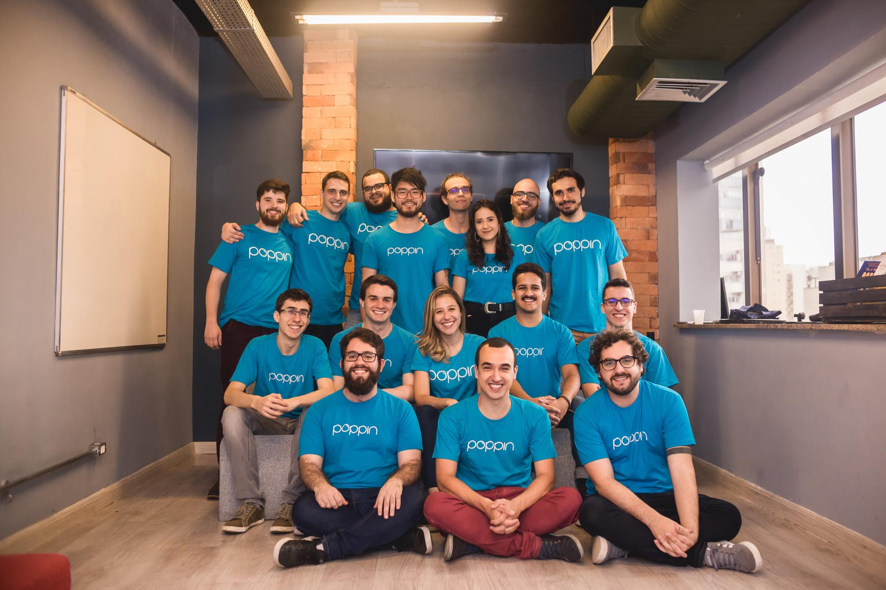

Note:
* Inicio de uma area de BI/DS séria
* Caio veio pro time
* Reuniões semanais para avaliar performance de algoritmos de feed com base
em métricas de usuário
* Métricas principais: quantos swipes pra dar um match e quantos matches
por usuário ativo

## Infra Para Ciência de Dados
* BigQuery, Google Cloud
* Jupyter em máquina dedicada
* Pipelines ETL iniciais

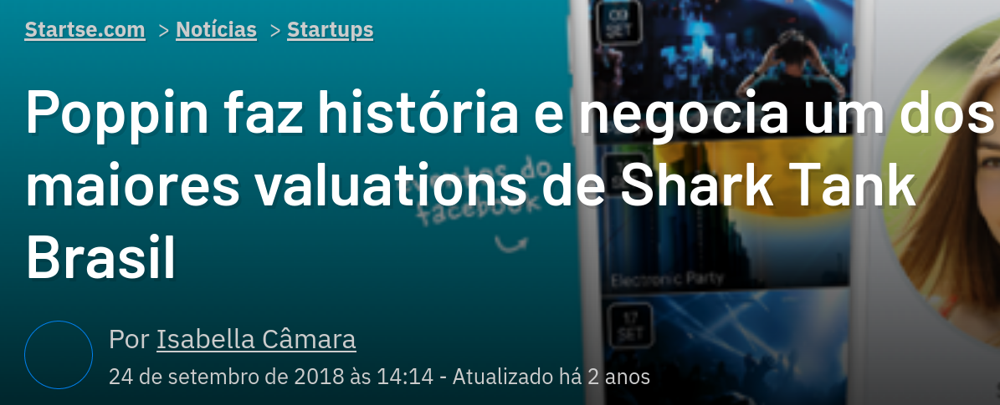

Note:
* Trabalho para mudar o algoritmo de feed como um todo, avaliando outras
plataformas de banco de dados.
* Trabalho concluído em janeiro - ganhador foi o Postgres

# 2019
#### Arrumando a casa
Note:
* Depois de tantas mudanças no ano anterior, usamos um tempo no inicio para
estruturar melhor algumas coisas
* Na infra iniciamos testes de carga para melhorar nossa escalabilidade automatica
* (explicar escalabilidade vertical e horizontal)

Note:
* Iniciamos testes de carga mais detalhados pra saber até que ponto uma instancia
do nosso back end aguentava para então determinar melhor o ponto de escalabilidade

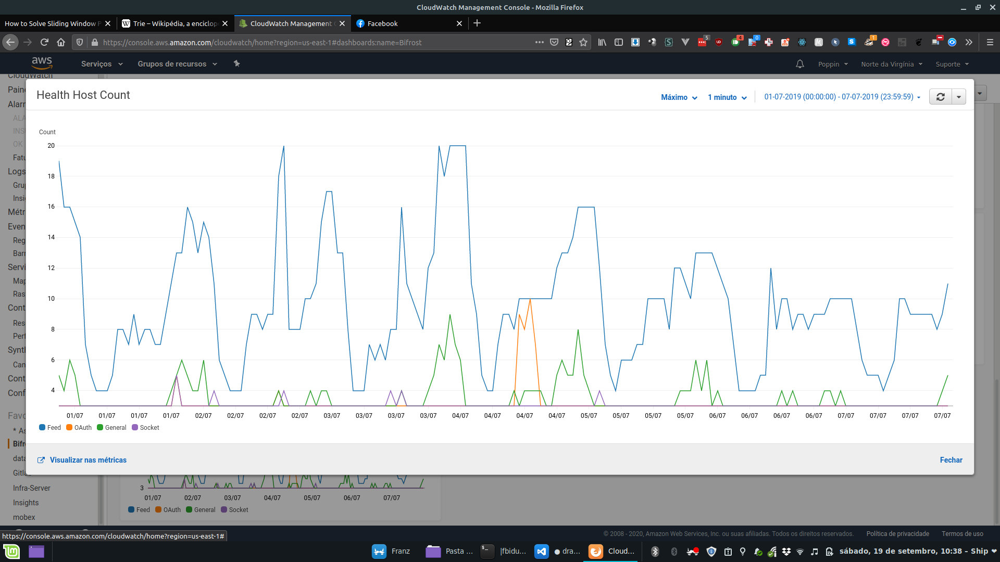

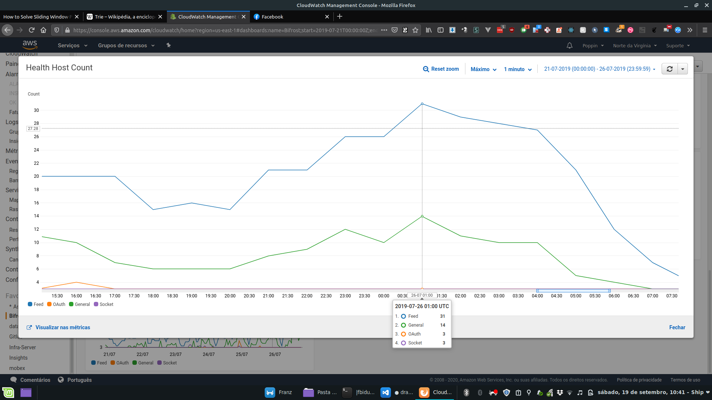

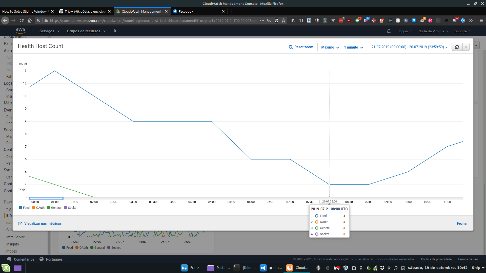

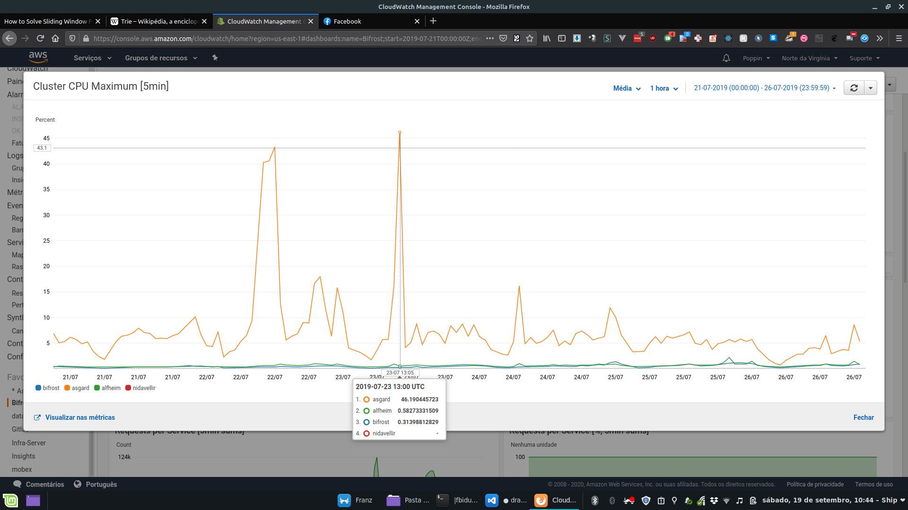

Nova peça de infra: Bifrost!

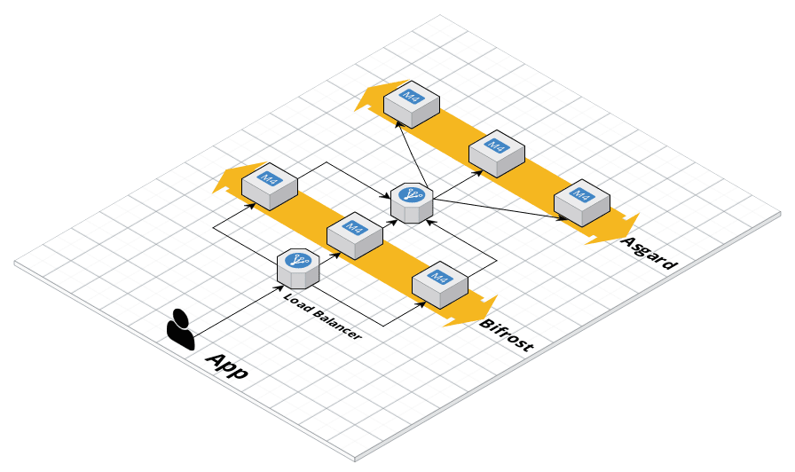
Note:
* explicar o conceito de proxy reverso

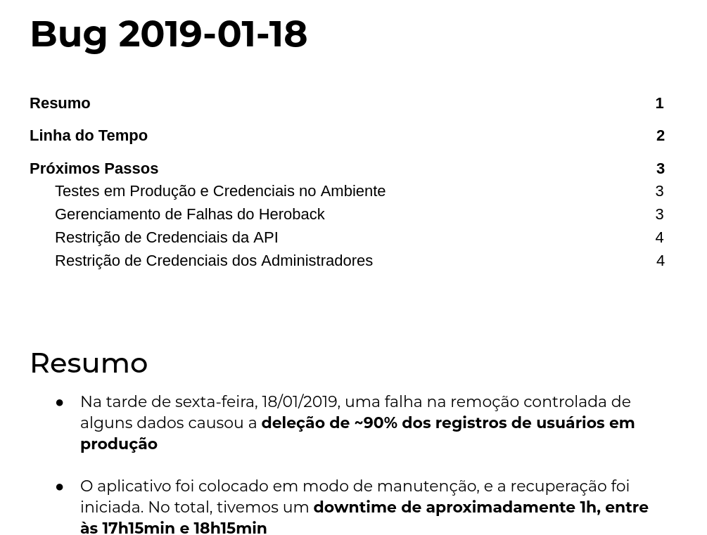
Note:
* Explicar o conceito de post morten e esse bug em especial

Note:
* Adição do airflow

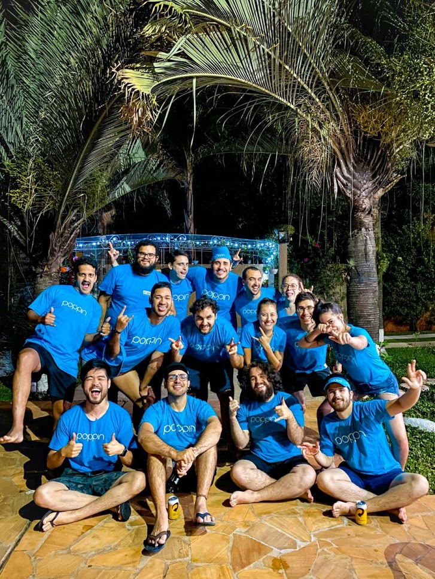
Note:
* Uma das ultimas fotos da equipe

# Muito obrigado!

* felipe@felipevr.com
* [github.com/fbidu](https://github.com/fbidu)
* Twitter @fevir0
