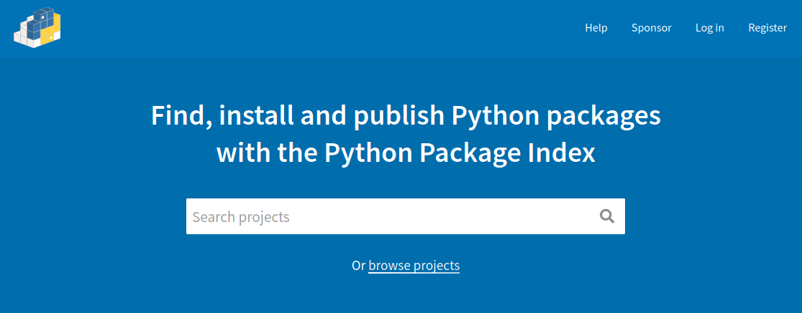
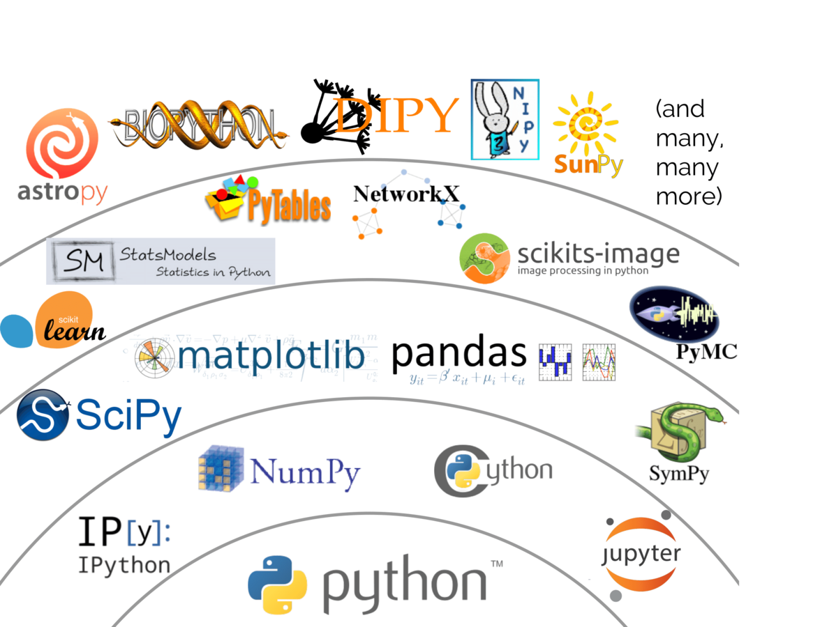
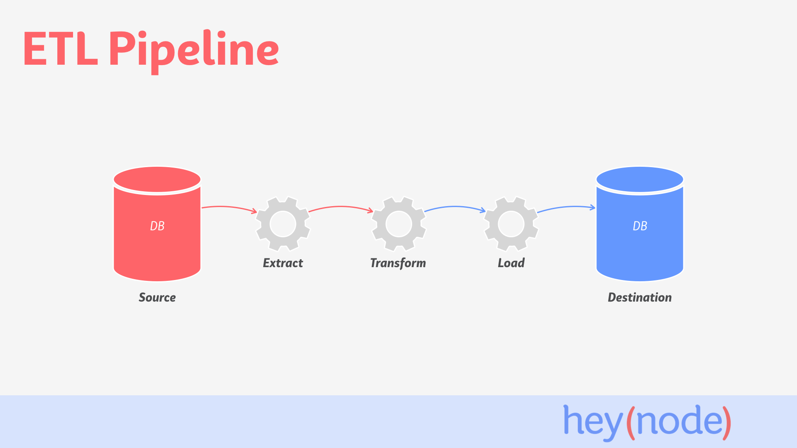
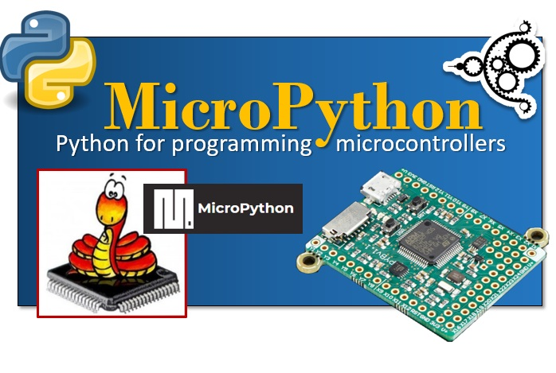

# Introdução ao Python

#### Linguagem & Comunidade


Aperte a tecla `"s"` para ver as notas de apresentação!


### Oi, eu sou o (Felipe) Bidu!

* [github.com/fbidu](https://github.com/fbidu)
* Instituto de Computação - UNICAMP
* Desenvolvedor na [Ingresse](https://ingresse.com)


# Python ― Uma Linguagem
Note:
* Vamo começar nosso papo hoje falando sobre a linguagem de programação Python
* Como vocês já possuem uma certa vivência com programação, vou começar mostrando
  um código funcional


```python
nomes = ["Tupã", "Campinas"]

for nome in nomes:
    print(nome.upper())

    if nome == "Tupã":
        print(f"Olá, {nome}")
```

```txt
TUPÃ
Olá, Tupã
CAMPINAS
```
Note:
* Esse código começa o trabalho declarando uma lista de nomes. Então ele faz um
  loop por cada item da lista, guardando o valor de cada elemento ana variável
  "nome". Para cada nome, ele vai imprimir o próprio nome com letras maiúsculas.
  Caso o nome seja igual à Tupã, ele vai imprimir uma string 'olá' somada ao
  valor da variável nome
* Vamo quebrar pedaços desse código para entender melhor como a linguagem funciona


```python
nomes = ["Tupã", "Campinas"]
```
Note:
* Logo de início a gente percebe uma coisa importante - declaramos variáveis
  de maneira livre, sem precisar declarar um tipo.
* Isso é uma característica diferente de outras linguagens como Pascal, Java e C
  e similar ao que acontece em PHP e JavaScript
* Nesse modelo de tipagem o que acontece por baixo dos panos é que o interpretador
  da linguagem analisa o tipo do elemento no lado direito, no caso uma lista
  e atribui ao lado esquerdo, sem que a pessoa desenvolvedora precise deixar
  explícito esse tipo


```python
for nome in nomes
```
Note:
* Outra coisa que chama nossa atenção é a estrutura do loop for. Em algumas
  linguagens a única forma que temos para fazer o loop for é através de um contador.
  Algo como 'for i igual à 0; i menor que dez' etc.
* Esse tipo de loop que vocês estão vendo aqui é chamado de "for each". Ele aparece
  também em muitas outras linguagens, como PHP. A diferença aqui é que esse é
  o único for que python define - loop for em python é pensado para lidar com
  coisas que são iteráveis


```python
print(nome.upper())
```
Note:
* Informações são impressas na tela usando a função `print`
* Outra coisa que notamos aqui é a a sintaxe ".upper()". Nome é uma string,
  strings definem um método chamado "upper" que quando ele é invocado, retorna
  uma cópia daquela string com letras maiúsculas. Essa sintaxe de .upper() invoca
  esse método


```python
if nome == "Tupã":
```
Note:
* Em Python nós temos a estrutura if...else como condicionais. Aqui no caso
  a gente tem uma estrutura de comparação de igualdade. Se nome for Tupã,
  vamos executar alguma coisa...


```python
print(f"Olá, {nome}")
```
Note:
* E então temos um print de novo. Mas agora tem alguma coisa diferente nele.
* A string começa com um "f" e tem aquelas chaves ali. Isso é chamado de "f-string"
  e desde o Python 3.6 são a forma mais legal de juntar o conteúdo de uma variável
  dentro de um string


```python
print(f"Olá, {nome}")
print("Olá, {}".format(nome))
print("Olá, %s" % nome)
print("Olá, " + nome)
print("Olá,", nome)
```
Note:
* Infelizmente não é a única. Esse é um dos pontos que a linguagem te oferece
  diversas formas de lidar com a situação, então qualquer uma dessas estruturas
  são funcionais


```python
x = 10
y = 20.3

bool = True

```


# Python ― Um Ecossistema
Note:
* Muito além da sintaxe base do Python, a linguagem desenvolveu também um
  ecossistema de bibliotecas e frameworks para as mais diversas situações
* Isso permite que a comunidade colabore no desenvolvimento de software e facilita
  o trabalho de todo mundo




[Python Package Index](https://pypi.org/)


```python
from flask import Flask

app = Flask(__name__)

@app.route("/")
def home():
  return "Hello, world!!"

app.run()
```
Note:
* Aqui nesse exemplo a gente tem uma aplicação HTTP mínima usando Flask, que é
  uma das formas de fazer app HTTP em Python
* A parte central disso tudo são as linhas ali no meio. A função "home" apenas
  retorna uma string. Como fazer então pra que essa função seja usada como resposta
  de uma chamada web?
* É aí que vem a linha em cima da definição de função. o "@app.route" é uma
  estrutura conhecida como 'decorador'. Ela serve pra pegar uma função, embrulhar
  ela com outra e fazer com que a função 'embrulhada' seja usada para outra coisa,
  tenha seu comportamento alterado, etc.
* No caso esse decorador aí serve para contar para o flask que o resultado da
  função "home" deve ser usado como resposta para pedidos HTTP na rota "/"



Note:
* Uma outra área extremamente forte no Python é a comunidade de computação
  científica e de ciência de dados
* Tudo o que vocês estão vendo nessa foto detalha um pedaço da comunidade
* <explicar as camadas>



Note:
* Um fluxo importante na hora de lidar com ciência de dados é o chamado ETL
* Nesse fluxo nós começamos com uma fonte de dados mais 'crus', com o banco de
  dados de uma aplicação e terminamos com um banco de dados mais apropriado para
  tarefas de ciência de dados
* <falar do airflow>



Note:
* Python também tem uma versão voltada para microcontroladores


Áreas que precisam melhorar:

* Mobile (Kivy & BeeWare)
* Front-End web (Brython & PyIodide)
Note:
* Existem projetos bem promissores nas duas áreas mas nenhum muito maduro ainda
* Para mobile temos o Kivy e o BeeWare
* Para front web temos o Brython e o PyIodide


# Python ― Uma Comunidade
Note:
* Python possui ao seu redor uma comunidade muito forte espalhada por todo o
  planeta
* Temos diversos eventos e grupos temáticos


# Referências


# Muito obrigado!

* felipe@felipevr.com
* [github.com/fbidu](https://github.com/fbidu)
* Twitter @fevir0
