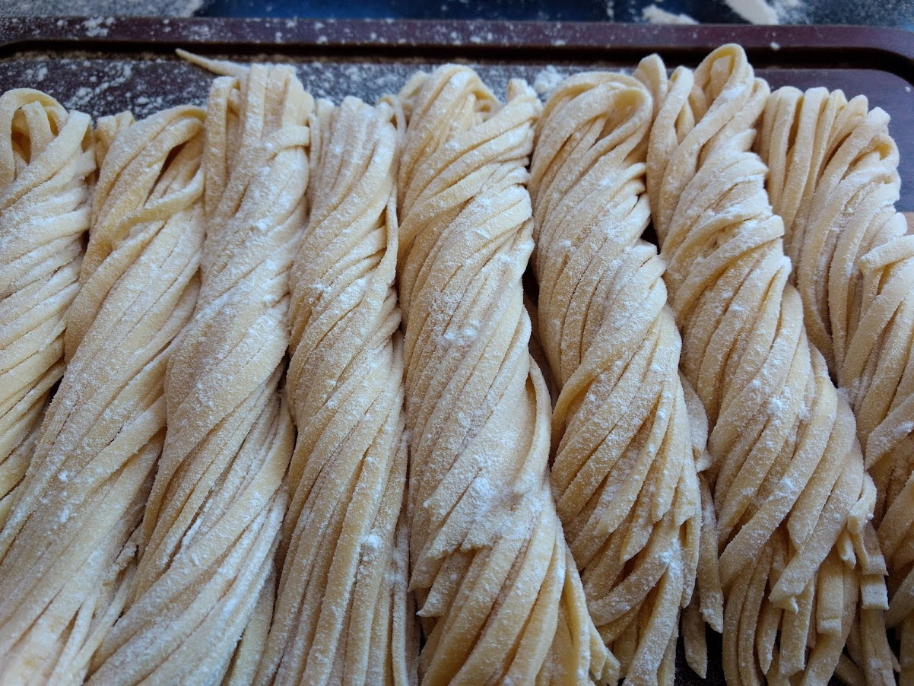

# Computação - A Ciência, o Mercado e a Graduação

Ou: uma breve crônica de uma jornada real

Aperte a tecla `"s"` para ver as notas de apresentação!

### Oi, eu sou o (Felipe) Bidu!

* [github.com/fbidu](https://github.com/fbidu)
* Instituto de Computação - UNICAMP
* Desenvolvedor na [Doist](https://doist.com)

# ⚠️ Alerta ⚠️

#### O que essa palestra não é

Note:
* Na palestra de hoje eu vou contar para vocês de forma bem resumida a minha
jornada na computação, antes, durante e depois da graduação
* Eu não pretendo de forma nenhuma convencer ninguém a fazer o que eu fiz, a
minha proposta aqui é simplesmente narrar as diversas coisas que aconteceram
e o que eu aprendi com elas
* Eu espero que a minha jornada, confusa e embaralhada como foi em muitas partes
possam ajudar vocês a pensar no que vocês querem - ou não! - na jornada de vocês

## Eu e a Computação Antes da UNICAMP
#### (2007-2014)
Note:
* Minha jornada "profissional" na computação começou quando eu estava no ensino
médio. Por "profissional" eu quero dizer simplesmente que alguém me pagava
para escrever códigos e que eu tinha uma carteira assinada,
não que eu era necessariamente bom nisso

Note:
* Nessa época eu trabalhei bastante com uma linguagem de programação já não
tão popular assim, o Delphi, lá no interiorzão de SP, em Tupã
* Para resumir bem, eu amava desenvolver software e isso era basicamente tudo
o que eu fazia da vida. Trabalhava com programação, meu hobby principal era
programação. Isso nem sempre acaba bem e quando eu tinha mais ou menos 18 ou 19 anos
eu me sentia bem saturado e cansado

## tenha um hobby fora da computação
Note:
* Essas dicas que eu coloquei aqui é meio eu conversando comigo no passado
* Tudo bem você ter coisas de computação como algum hobby seu. Eu particularmente
faço muita coisa no meu tempo livre com computadores. O problema pra mim foi
não ter nenhum hobby _fora_ da computação

Note:
* Cada um sabe o que é melhor pra si, no meu caso é culinária. Na minha família
todo mundo cozinha desde criança, então foi fácil me identificar

## Quando tiver trabalhando e as coisas ficarem ainda mais confusas, tenha um orçamento
Note:
* Nos momentos em que minha vida profissional ou acadêmica ficaram muito corridas
é fácil acabar esquecendo de seus hobbies.
* O que me ajuda a prestar atenção nisso é simplesmente reservar um pouquinho
do que ganho para coisas de cozinha. 
* Não é muito, mas quando termina o mês e eu vejo que nem liguei pra culinária,
me alerta que eu to negligenciando numa coisa que é importante pra mim

## UNICAMP
#### (2014-2021)
Note:
* Até 2014 eu trabalhei, entrei na faculdade de Física, na UNESP de Rio Claro,
saí da faculdade de física, fui pra um cursinho, voltei a trabalhar com computação
* Finalmente, em 2013, eu decidi encarar uma graduação em computação! Em 2014,
entrei na UNICAMP, em Engenharia da Computação

## Mas... E a sua carreira?
Note:
* Uma pergunta que sempre aparece nessa história é porque eu "sairia" do mercado
e encararia uma graduação
* A verdade é que eu não 'larguei' tudo de fato
* No meu primeiro mês aqui na UNICAMP eu comecei a trabalhar como desenvolvedor
em um laboratório de bioinformática e genômica daqui, o LaCTAD

### LaCTAD (2014-2018)

## Talvez eu tenha voltado ao trabalho _rápido demais_
Note:
* É muito fácil eu olhar pra 7 anos no passado e falar 'hmm bidu, vc fez merda ali'
* Mas, por outro lado, é esse o ponto da minha palestra aqui
* Particularmente, eu me arrependo um pouco de ter voltado pro mercado tão rápido
e com tanta intensidade. 
* Trabalhar enquanto faz uma graduação já é complicado. Eu não soube lidar bem
com meu trabalho - que era muito legal - com as coisas "chatas" do primeiro
ano da graduação
* Olhando pra trás, eu acho que em todo momento da graduação eu acabei dando
menos atenção pra algumas oportunidades únicas da unicamp enquanto estava lá
* Por exemplo, eu trabalhei no LaCTAD por 4 anos, eu fiz colaborações esporádicas
com outros laboratórios no campus mas eu nunca fiz uma iniciação científica
propriamente dita. Isso é uma coisa que, olhando pra trás, eu me arrependo

### 2015 - Mais um emprego

Note:
* Não feliz com estar na graduação ao mesmo tempo que tinha um trabalho 'part time',
eu arrumei _outro_ emprego
* Aqui em campinas a gente tem um ecossistema de startups de tecnologia bem
interessante
* Em 2015 eu comecei a trabalhar numa software house com outros colegas de unicamp
- praticamente todo mundo aí nessa foto foi aluno da unicamp - e em 2016 eu
participei da criação do Poppin

### 2016-2020 - Poppin

Note:
* Muito daora participar da construção de algo assim, a gente foi o maior caso
de sucesso de social media e de dating apps brasileiros. Não vou falar muito dele,
tenho uma outra palestra sobre isso

## 2015 - Comvest! De novo
Note:
* 2014 veio e foi, 2015 já estava no fim quando eu percebi que me identificava
mais com ciência da computação do que com engenharia. Além disso, seria mais
fácil conciliar todas as coisa que eu fazia. Lembrando que de 2015 até 2018 eu
manteria dois empregos e do começo ao fim da graduação pelo menos 1
* Eu tomei essa decisão quando o prazo de transferência de curso já tinha passado,
então eu prestei o vestibular. De novo. Em 2016, me matriculei em Ciência da Computação

## Comunidades (2013 - )
Note:
* Agora eu vou falar um pouco de outras coisas além da graduação
* Uma outra possibilidade na computação e algo que fiz e faço bastante é participar
de comunidades que são criadas em volta de alguma tecnologia
* Eu participo de iniciativas assim desde antes de entrar na unicamp e continuo
até hoje

### Hackathons

Note:
* Uma outra coisa que fiz bastante nesses tempos foi participar de hackathons
* Basicamente são maratonas de programação auto-organizadas ou organizadas por empresas
* São eventos bem legais pra você conhecer pessoas da área que não são do seu
círculo imediato

Note:
* Infelizmente, hoje, tem muito "hackathon" que são basicamente uma forma barata
e esquisita de empresas que tão sem criatividade de arrumar alguma coisa nova.
Dê sempre uma lida nos regulamentos antes!

Note:
* Bem, é difícil fazer um recorte justo numa história que cobre tanto tempo,
eu vou encerrar por aqui para dar tempo para perguntas
* Computação é uma área incrível, recheada de oportunidades e de possibilidades
* A UNICAMP possui uma tradição enorme na área. Além disso, aqui nós reunimos
pessoas brilhantes de diversas áreas do conhecimento, permitindo colaborações
fantásticas. Meu antigo laboratório, por exemplo, é uma iniciativa que envolve
nossos instititutos de biologia, química e computação além das faculdades de
medicina e farmácia
* A Unicamp, por sua vez, está inserida no polo de Campinas, que vai em si ter
inúmeras oportunidades interessantes para nossa área
* Escolher um caminho é difícil, explorar possibilidades é divertido. Pra mim,
o que foi fundamental na minha jornada até aqui, foi ter tido a oportunidade
de me expor a coisas diferentes, dentro e fora da graduação
* Esse pra mim é o grande diferencial e é o que torna Campinas e em particular
a Unicamp o "lugar para se estar" em termos de computação
* Eu vou agora abrir para perguntas 

# Muito obrigado!

* Veja a palestra de novo em https://bit.ly/bidu-upa
* felipe@felipevr.com
* [github.com/fbidu](https://github.com/fbidu)
* Twitter @fevir0
